# 예외처리(Exception Handling)

- 에러와 예외
  - 어떤 원인에 의해 오동작 하거나 비정상적으로 종료되는 경우
  - 심각도에 따른 분류
    - Error
      - 메모리 부족, stack overflow와 같이 일단 발생하면 복구할 수 없는 상황
      - 프로그램의 비 정상적 종료를 막을 수 없음 -> 디버깅 필요
    - Exception
      - 읽으려는 파일이 없거나, 네트워크 연결이 안 되는 등 수습될 수 있는 비교적 상태가 약한 것들
      - 프로그램 코드에 의해 수습될 수 있는 상황

### 예외처리란?

- 예외 발생 시 프로그램의 비정상 종료를 막고 정상적인 실행 상태를 유지하는 것
- 예외의 감지 및 예외 발생 시 동작할 코드 작성 필요

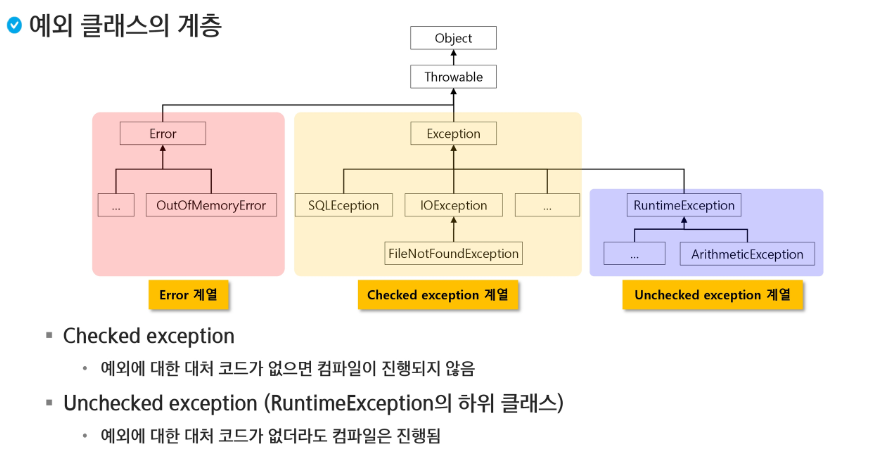

> Error나 Exception도 하나의 클래스이기 때문에 뿌리를 찾아가면 Object이다.
>
> `checked exception`은 에디터에 빨간줄 그어진 것도 포함

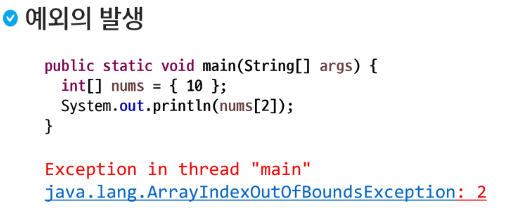

```java
package com.ssafy.exception;

public class ExceptionTest1 {
	public static void main(String[] args) {
		int[] nums = {10};
		int[] nums2 = new int[] {10};
		
		//Unchecked Exception
		System.out.println(nums[2]);
		
		//Checked Exception
		Thread.sleep(1000);
		
		System.out.println("Quit program");
	}
}
```


### 예외 처리 키워드

- 직접 처리
  - try
  - catch
  - finally
- 간접 처리
  - throws
- 사용자 정의 예외처리
  - throw

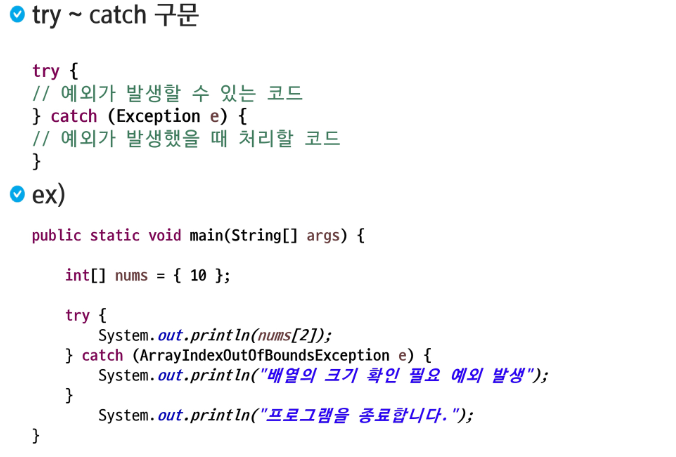

> Unchecked는 필수 X, Checked는 필수 O

```java
package com.ssafy.exception;

public class ExceptionTest1 {
	public static void main(String[] args) {
		int[] nums = {10};
		
		//Unchecked Exception
		try {
			System.out.println(nums[2]);
		} catch (ArrayIndexOutOfBoundsException e) {
			System.out.println("Please check the length of the Array");
		}
		
		System.out.println("Quit program");
	}
}
```

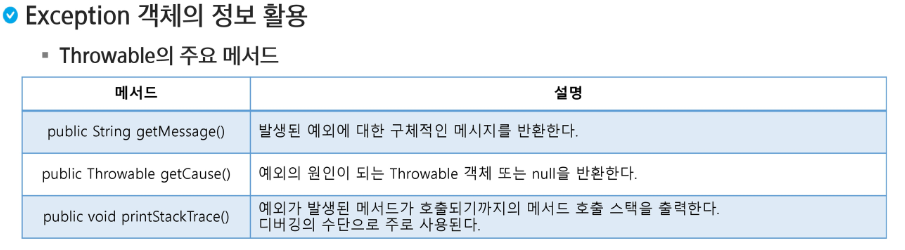

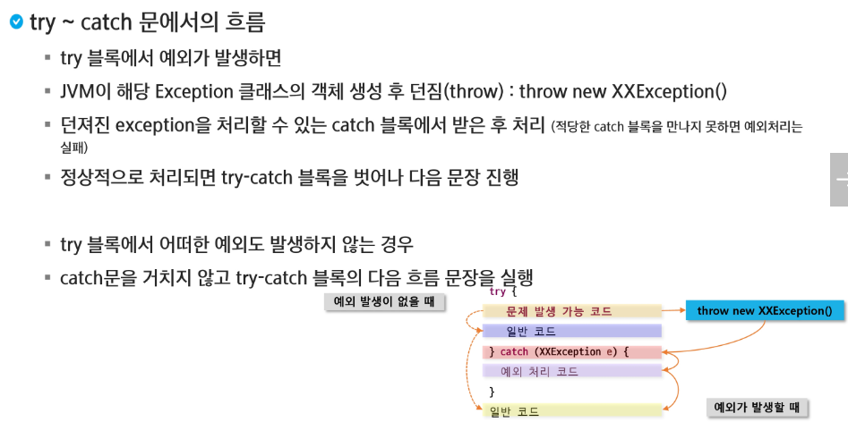

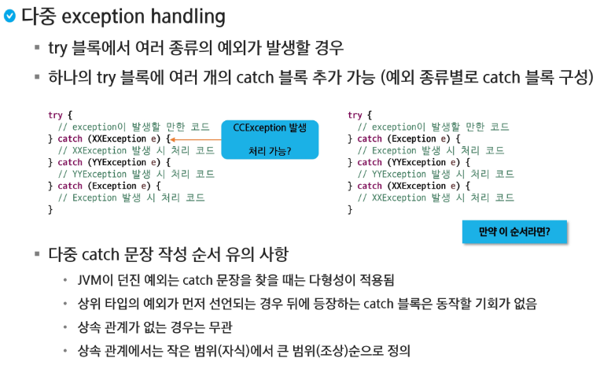

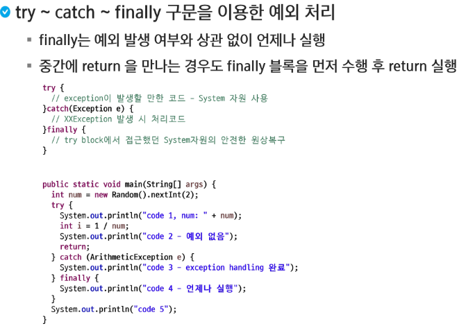

```java
package com.ssafy.exception;

import java.util.Random;

public class ExceptionTest4 {
	public static void main(String[] args) {
//		int num = new Random().nextInt(2);
//		int num = 1; // 1 2 4까지 출력하고 return되어서 5는 미출력
		int num = 0; // 1 3 4 5
		
		try {
			System.out.println("1");
			int i = 1 / num; // 예외가 발생할 수 있는 부분
			System.out.println("2");
			return;
		} catch (ArithmeticException e) {
			System.out.println("3");
		} finally {
			System.out.println("4");
		}
		System.out.println("5");
		
	}
}
```

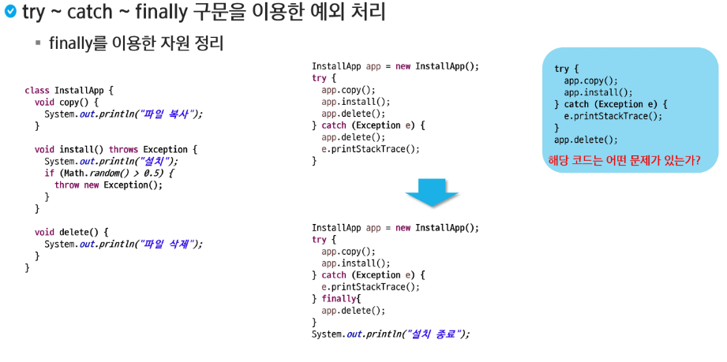

- 자원반납은 `finally`를 사용해주는 것이 좋음
  - 파란색 블럭 안에 처럼 `try`, `catch` 구문 밖에 있으면 재해석의 위험이 있고, `return`이 혹시나 존재하게 된다면 `delete()`가 실행이 되지 않을 위험도 존재한다.


> `exceptionMethod` 메소드 자체 내에서 예외 처리를 하지 않고 예외를 던져버림. 그럼 그 예외가 나를 불렀던 곳으로 이동. 즉, 나를 불렀던 곳으로 책임을 전가 시킴.


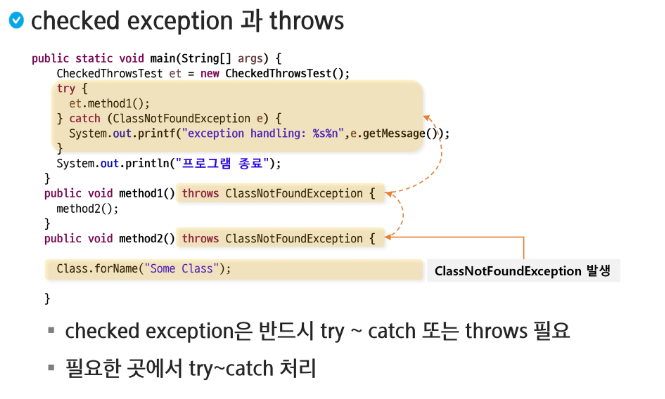

```java
package com.ssafy.exception2;

public class CheckedExceptionTest {
	public static void main(String[] args) {
		
		// 1. static을 아래 메서드에 모두 추가해주거나
		// 2. CheckedExceptionTest 객체를 만들어서 사용 하면 된다.
		CheckedExceptionTest c = new CheckedExceptionTest();
		try {
			c.method1();
		} catch (Exception e) {
			// TODO Auto-generated catch block
			e.printStackTrace();
		}
	}
	
	public void method1() {
		method2();
	}
	
	public void method2() {
		int i = 1 / 0;
	}
}
```

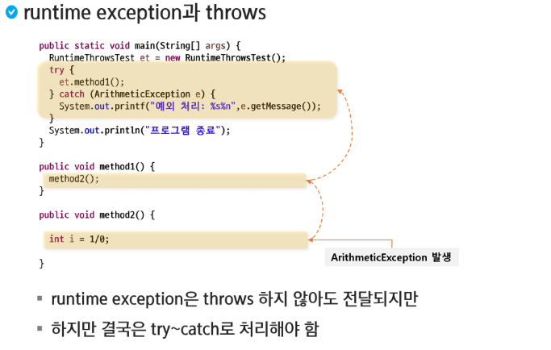

> 📌 `Unchecked`는 놓치기 쉽다

```java
package com.ssafy.exception2;

public class UnCheckedException {
	public static void main(String[] args) {
		
		// 1. static을 아래 메서드에 모두 추가해주거나
		// 2. CheckedExceptionTest 객체를 만들어서 사용 하면 된다.
		UnCheckedException c = new UnCheckedException();
		try {
			c.method1();
		} catch (ClassNotFoundException e) {
			// TODO Auto-generated catch block
			e.printStackTrace();
		}
	}
	
	public void method1() throws ClassNotFoundException {
		method2();
	}
	
	public void method2() throws ClassNotFoundException {
		Class.forName("SSAFY");
	}
}
```

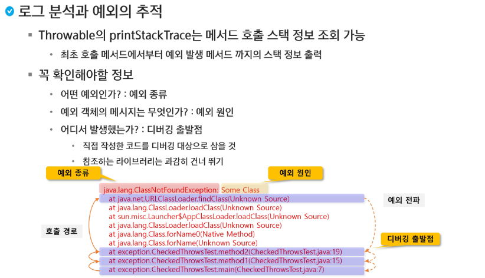

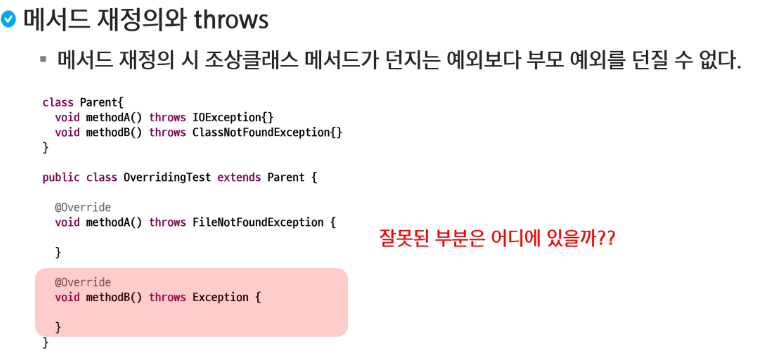

> 작은 범위에서 큰 범위로 던지는 것은 가능하지만 Exception같은 경우에는 다른 예외 처리가 올라갈 수 있으므로 사용할 수 없다. FileNotFoundException은 IOException을 상속 받고 있다.

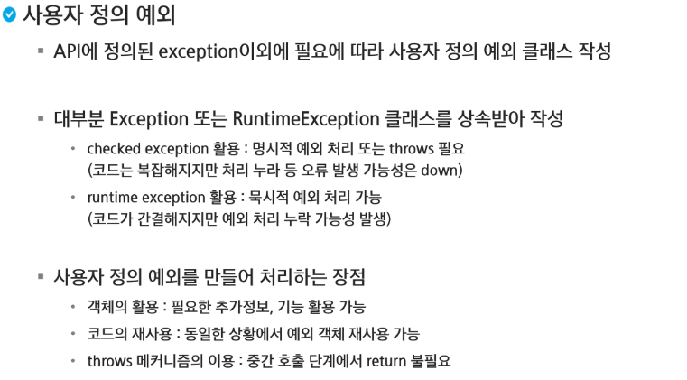

```java
package com.ssafy.exception;

import java.util.Arrays;

public class UserExceptionTest {
	private static String[] fruits = {"grape", "apple", "banana", "melon", "strawberry"};
	
	public static void main(String[] args) {
		boolean result = getFruit1("strawberry");
		if (!result) {
			System.out.println("There is no strawberry");
		}
		
		result = getFruit1("strawberry");
		if (!result) {
			System.out.println("There is no strawberry!!");
		}
		
//		try {
//			getFruit2("apple");
//			getFruit2("apple");
//		} catch (FruitNotFoundException e) {
//			// TODO Auto-generated catch block
//			e.printStackTrace();
//		}
		try {
			setFruit("orange");
			setFruit("orange");
		} catch (NoSpaceException e) {
			// TODO Auto-generated catch block
			e.printStackTrace();
		}
		System.out.println(Arrays.toString(fruits));
		
		
	}

	
	// name 과일이 있따면 true를 반환하고 해당 위치의 과일을 null
	public static boolean getFruit1(String name) {
		for (int i = 0; i < fruits.length; i++) {
			if (fruits[i] != null && fruits[i].equals(name)) {
				fruits[i] = null;
				return true;
			}
		}
		return false;
	}
	
	// 예외를 만들어서 발생시켜보자
	public static void getFruit2(String name) throws FruitNotFoundException {
		for (int i = 0; i < fruits.length; i++) {
			if (fruits[i] != null && fruits[i].equals(name)) {
				fruits[i] = null;
				return;
			}
		}
		throw new FruitNotFoundException(name);
	}
	
	//배열에 null인 지점에 과일을 저장하도록 작성하시구요. 없으면 NoSpaceException 작성해보세요.
	public static void setFruit(String name) throws NoSpaceException {
		for (int i = 0; i < fruits.length; i++ ) {
			if (fruits[i] == null) {
				fruits[i] = name;
				return;
			}
		}
		throw new NoSpaceException(name);
	}
	
}
```

```java
package com.ssafy.exception;

public class NoSpaceException extends Exception{

	public NoSpaceException(String name) {
		super("There is no space, bro!!");
	}

}
```

