# 입출력 API

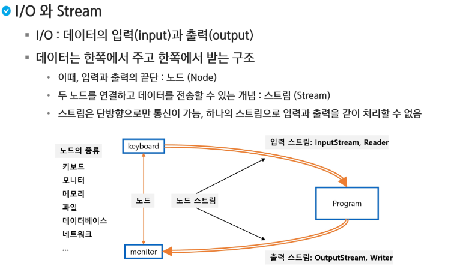

### I/O 처리 단위

|       |     byte     |  Char  |
| :---: | :----------: | :----: |
| 입 력 | InputStream  | Reader |
| 출 력 | OutputStream | Writer |

> `byte` 단위나 `문자 ` 단위로 처리함. 들어오는 데이터 단위에 따라 나뉜다.

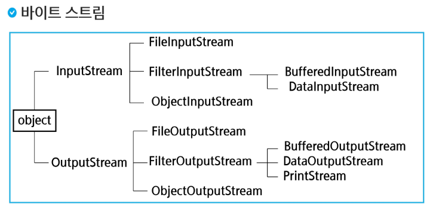

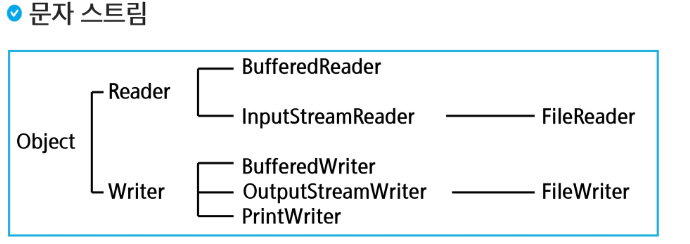

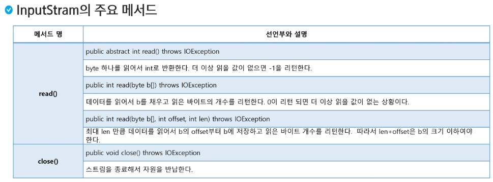

> `byte b[]` 바이트 배열이 들어오는 것을 버퍼라고 부름. 데이터를 채우는 과정을 버퍼링.  

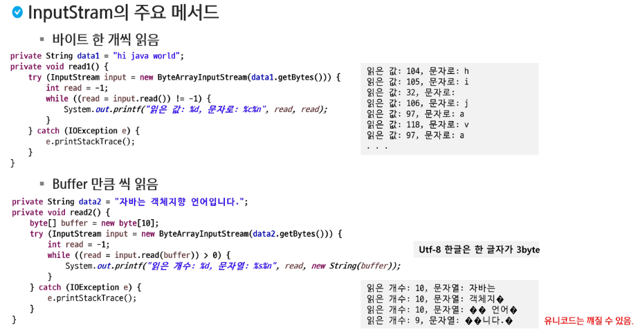

> `inputStream`은 통로이기 때문에 읽고 나서 닫아줘야 함. `try`를 쓰고 안에서 자동으로 닫힘

```java
package com.ssafy.inout1;

import java.io.ByteArrayInputStream;
import java.io.IOException;
import java.io.InputStream;

public class SimpleinputTest {
	public static void main(String[] args) {
		SimpleinputTest si = new SimpleinputTest();
		si.read1();
		si.read2();
	}
	
	String data2 = "java is OOP language!";
	
	void read2() {
		byte[] buffer = new byte[10];
		try(InputStream input = new ByteArrayInputStream(data2.getBytes())) {
			int read = -1;
			while ((read = input.read(buffer)) > 0) {
				System.out.printf("read length: %d, char: %s\n", read, new String(buffer, 0, read));
			}	
		} catch(IOException e) {
			e.printStackTrace();
		}
	}
	
	
	
	String data = "hi java world";
	
	void read1() {
		// try with resources
		try (InputStream input = new ByteArrayInputStream(data.getBytes())) {
			int read = -1;
			// 한 글자씩 읽을건데 -1이 아닐 때까지 돌기, 더 이상 읽을 게 없으면 -1 반환
			while ((read = input.read()) != -1) {
				System.out.printf("value: %d, char: %c \n", read, read);
			}
		} catch (IOException e) {
			e.printStackTrace();
		}
	}
}
```

> 한글은 바이트 단위로 읽을 수 없어서 깨짐.

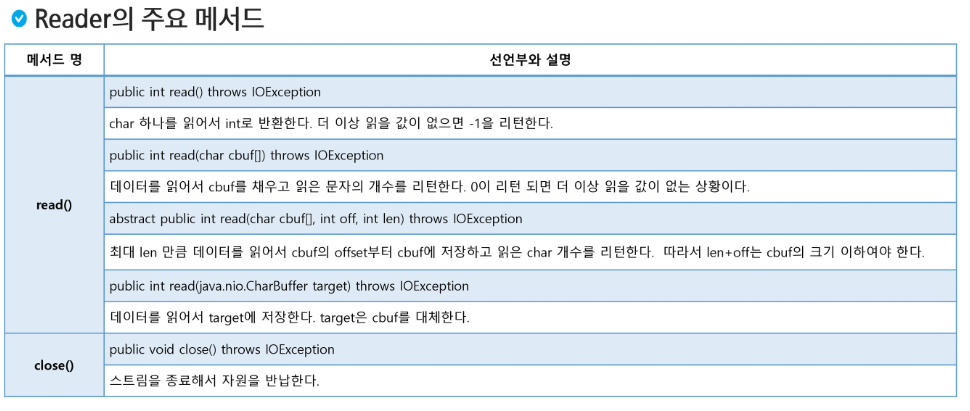

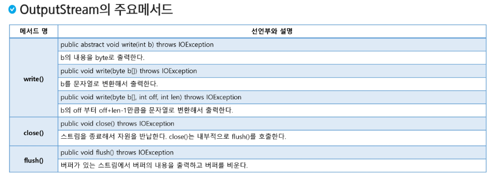

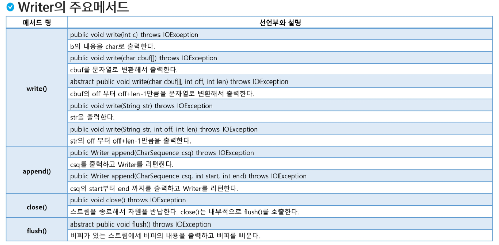

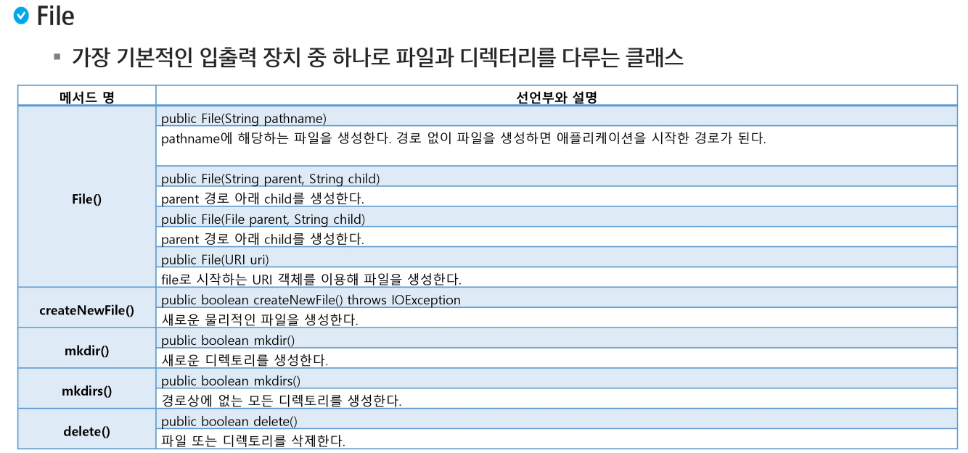

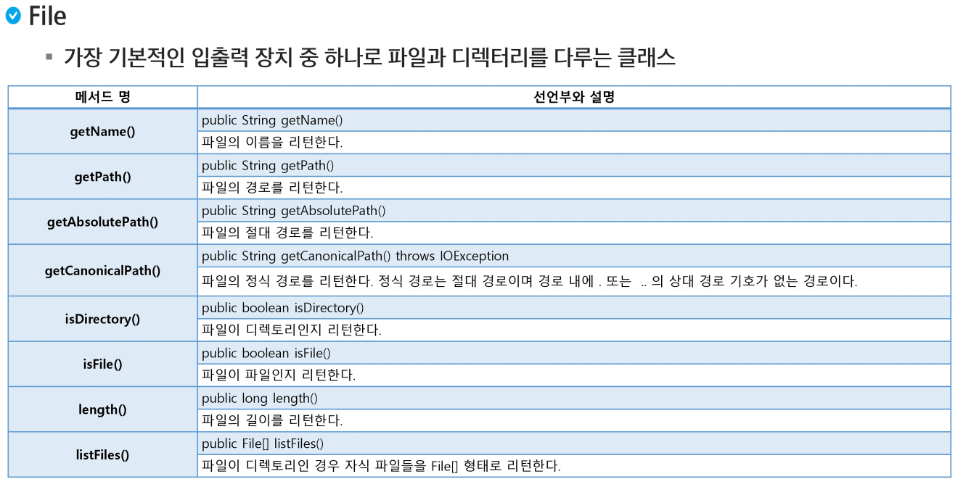

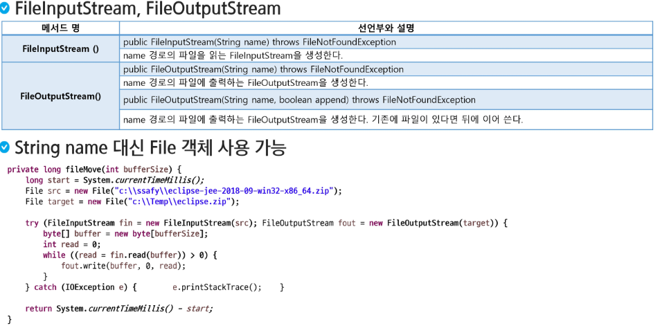

```java
package com.ssafy.inout1;

import java.io.FileInputStream;
import java.io.FileNotFoundException;
import java.io.FileOutputStream;
import java.io.IOException;

public class FileCopyTest {
	public static void main(String[] args) {
		String path = "C:\\Temp\\";
		
		String originFile = path + "Byejava.txt"; // InputStream에 넣을 예정
		String destFile = path + "copy.txt"; // OutputStream
		
		try (FileOutputStream fo = new FileOutputStream(destFile);
				FileInputStream fi = new FileInputStream(originFile)) {
			
			byte[] buf = new byte[1024];
			int size = 0;
			while ((size = fi.read(buf)) > 0) {
				fo.write(buf, 0, size);
			}
			
		} catch (FileNotFoundException e) {
			// TODO Auto-generated catch block
			e.printStackTrace();
		} catch (IOException e) {
			// TODO Auto-generated catch block
			e.printStackTrace();
		}
		
	}
}
```

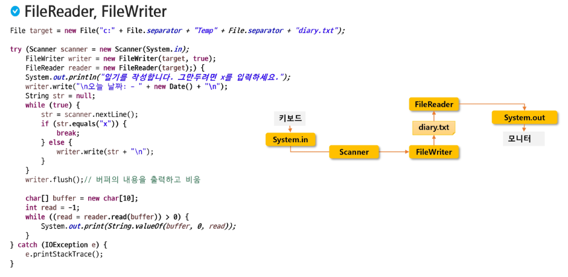

```java
package com.ssafy.inout1;

import java.io.File;
import java.io.FileReader;
import java.io.FileWriter;
import java.io.IOException;
import java.util.Date;
import java.util.Scanner;

public class diaryTest {
	public static void main(String[] args) {
		
		File target = new File("C:" + File.separator + "Temp" + File.separator + "diary.txt");
		
		try (Scanner scanner = new Scanner(System.in);
				FileWriter writer = new FileWriter(target, true);
				FileReader reader = new FileReader(target);) {
			System.out.println("Write diary. If you quit this, enter the 'x'");
			writer.write("\n Today's date: - " + new Date() + "\n");
			
			String str = null;
			while(true) {
				str = scanner.nextLine();
				if (str.equals("x")) {
					break;
				} else {
					writer.write(str + "\n");
				}
			}
			writer.flush(); //버퍼의 내용을 출력하고 비움
			
			char[] buffer = new char[1024];
			int read = -1;
			while ((read = reader.read(buffer)) != -1) {
//				System.out.println(buffer);
				System.out.println(String.valueOf(buffer, 0, read));
			}
		} catch (IOException e) {
			e.printStackTrace();
		}
	}
}
```

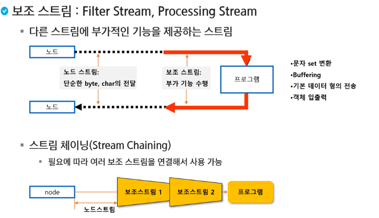

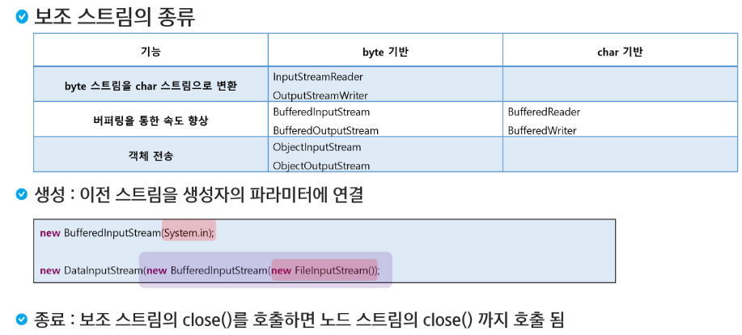

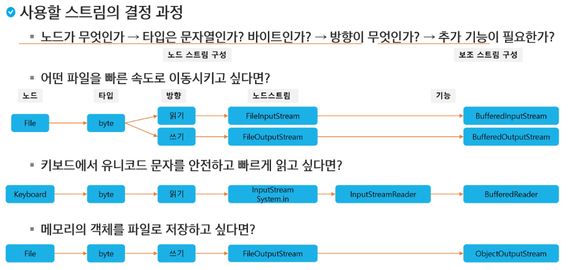

> InputStream은 바이트 단위인데 InputStreamReader로 문자열 단위로 바꿔줌

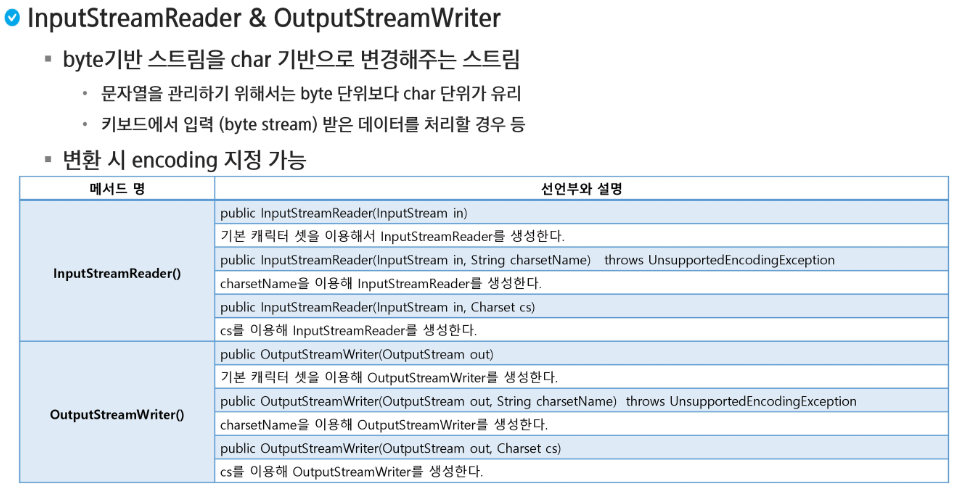

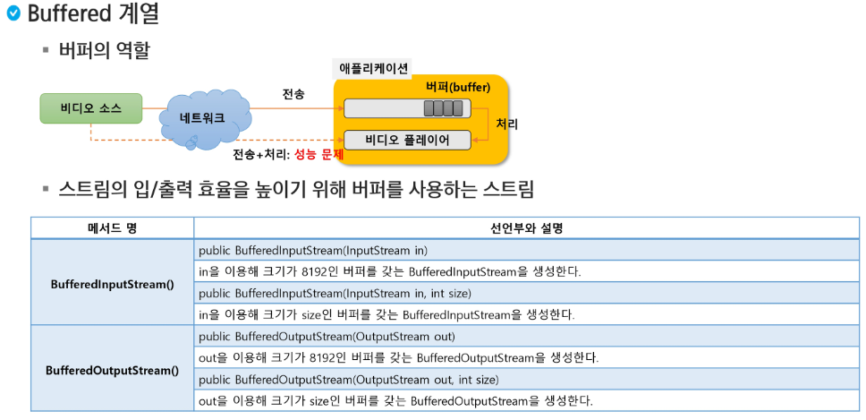

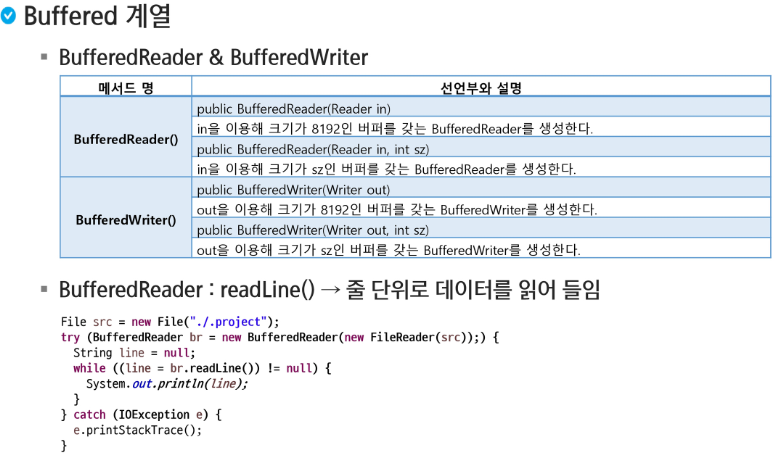

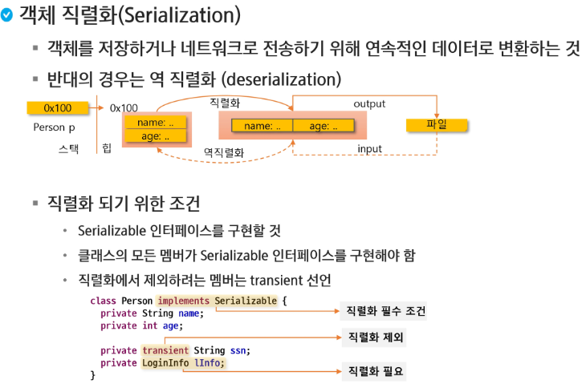

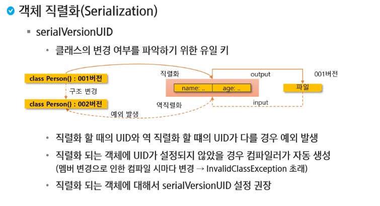

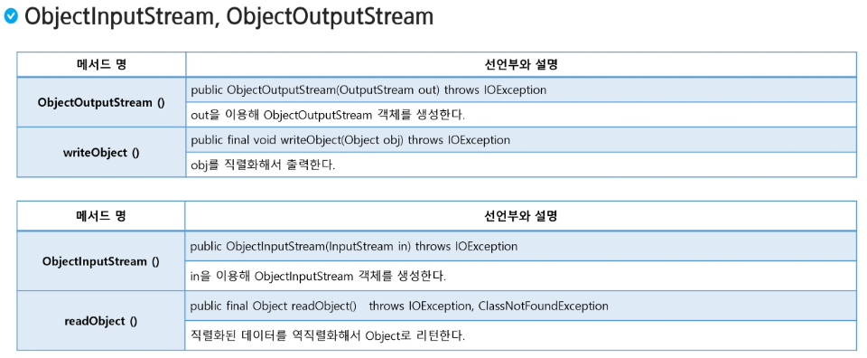

```java
package com.ssafy.inout2;

import java.io.FileNotFoundException;
import java.io.FileOutputStream;
import java.io.IOException;
import java.io.ObjectOutputStream;
import java.util.ArrayList;
import java.util.List;

public class PersonListWriteTest {
	public static void main(String[] args) {
		
		List<Person> list = new ArrayList<>();
		list.add(new Person("sangchan", "970"));
		list.add(new Person("hyung", "432"));
		list.add(new Person("kime", "123"));
		list.add(new Person("tandg", "456"));
		list.add(new Person("qwaetg", "241"));
		
		try(ObjectOutputStream os = new ObjectOutputStream(new FileOutputStream("personList.dat"))) {
			os.writeObject(list);
		} catch (FileNotFoundException e) {
			// TODO Auto-generated catch block
			e.printStackTrace();
		} catch (IOException e) {
			// TODO Auto-generated catch block
			e.printStackTrace();
		}
	}
}
```

```java
package com.ssafy.inout2;

import java.io.FileInputStream;
import java.io.FileNotFoundException;
import java.io.IOException;
import java.io.ObjectInputStream;
import java.util.List;

public class PersonListReadTest {
	public static void main(String[] args) {
		try(ObjectInputStream ois = new ObjectInputStream(new FileInputStream("personList.dat"))) {
			
			@SuppressWarnings("unchecked") //unchecked 무시하기
			List<Person> list = (List<Person>) ois.readObject();
			for(Person p : list) {
				System.out.println(p);
			}
			
		} catch (FileNotFoundException e) {
			// TODO Auto-generated catch block
			e.printStackTrace();
		} catch (IOException e) {
			// TODO Auto-generated catch block
			e.printStackTrace();
		} catch (ClassNotFoundException e) {
			// TODO Auto-generated catch block
			e.printStackTrace();
		}
	}
}
```

