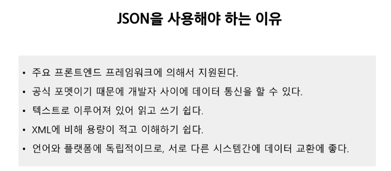
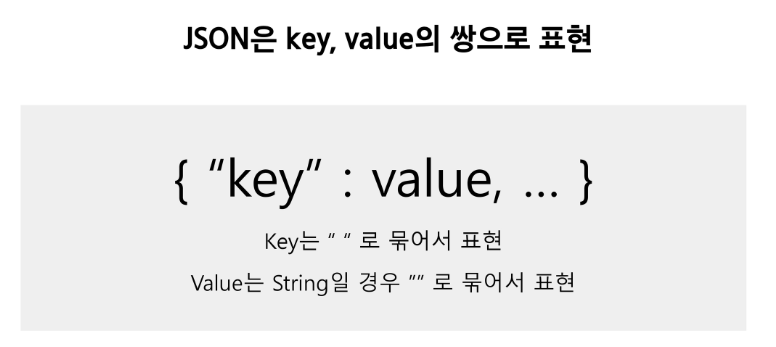
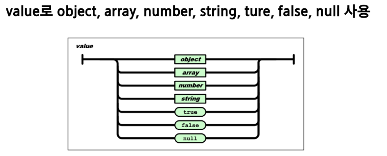
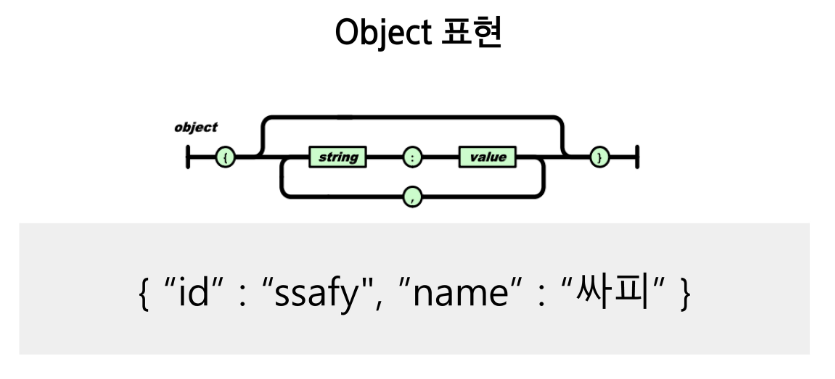
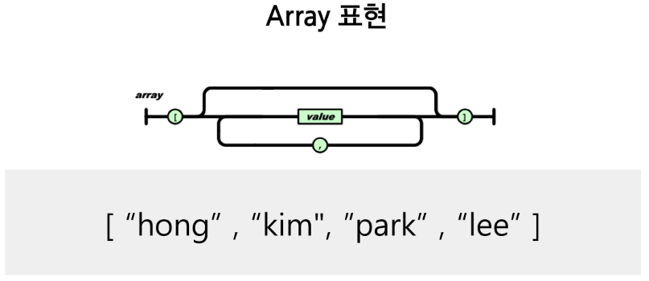
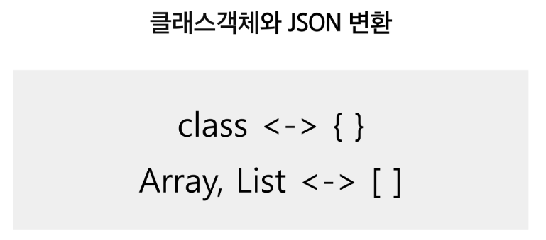
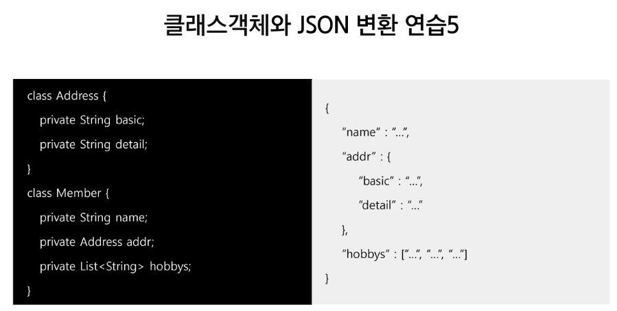

# JSON(JavaScript Object Notation)

- 자바스크립트에서 사용하는 객체 방식을 가져와서 쓰겠다.

- 자바스크립트를 토대로 개발
- 여러 프로그래밍 언어에서 사용할 수 있는 독립형 언어
- 웹클라이언트와 웹 서버 간 데이터 교환에 사용
- 웹브라우저 비동기 처리에 사용되는 AJAX의 데이터 교환 형식으로 널리 알려짐
- IETF RFC 7159, ECMA-404 표준으로 제정

