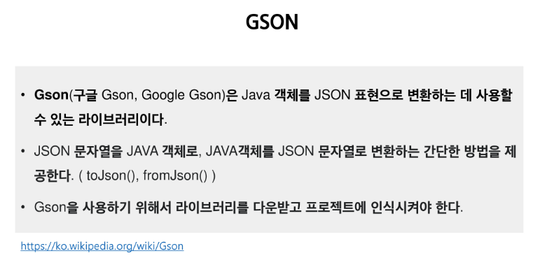
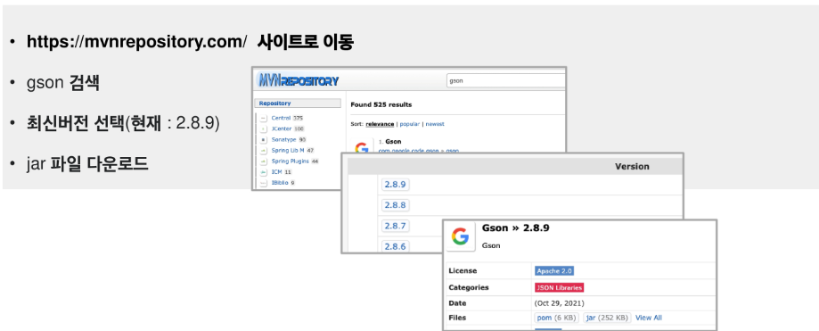
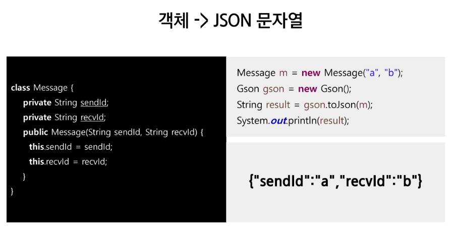
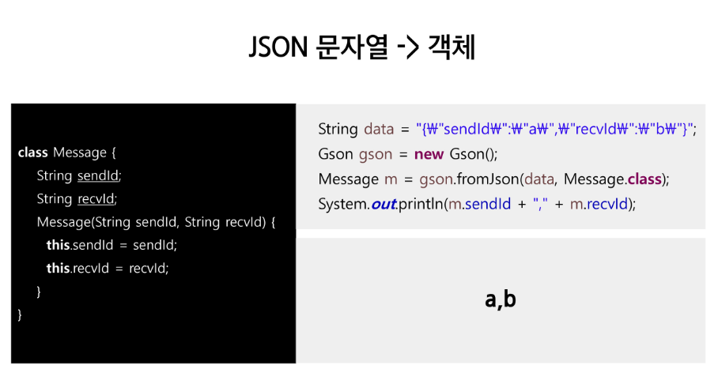
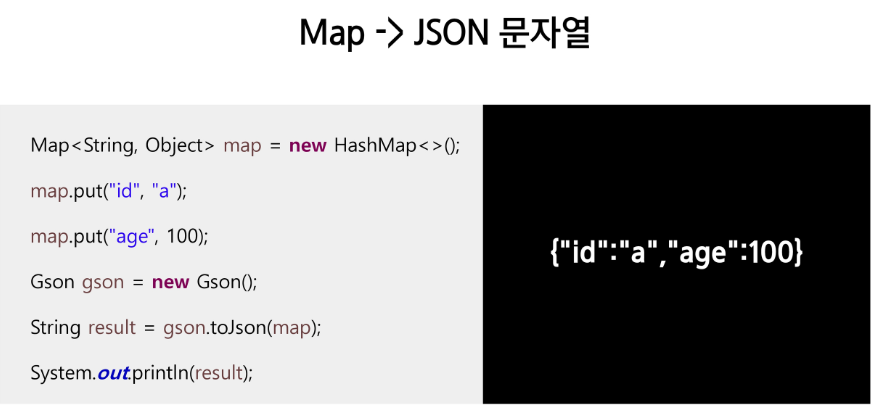
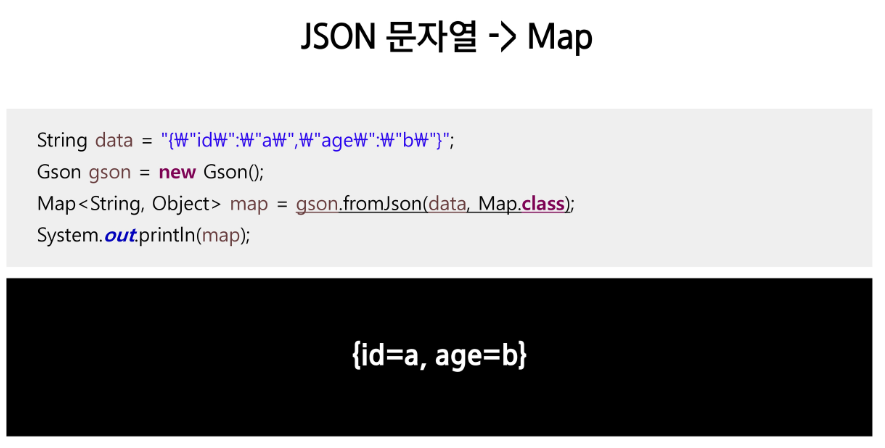

# GSON







```java
package com.ssafy.json;

import com.google.gson.Gson;

class Message {
	private String sendId;
	private String recvId;
	
	public Message(String sendId, String recvId) {
		this.sendId = sendId;
		this.recvId = recvId;
	}
	
}

public class Test {
	//라이브러리를 인식시키기
	// 방법1. JRE System Library에 끼워 넣기
	// 방법2. 외부에 존재하는 jar 파일을 인식시켜주기 //프로젝트 이사시 인식 안될수도..
	// 방법3. 프로젝트 내부에 jar 파일을 복사 해두고 인식시키기(우리가 하려고 하는 것)
	// 방법4. Maven을 이용하여 넣기
	
	public static void main(String[] args) {
		Message msg = new Message("Kim", "Lee");
		Gson gson = new Gson();
		
		String jsonMsg = gson.toJson(msg);
		System.out.println(jsonMsg);
	}
	
	
}
```








```java
package com.ssafy.json;

import java.util.HashMap;
import java.util.Map;

import com.google.gson.Gson;

class Message {
	private String sendId;
	private String recvId;
	
	public Message(String sendId, String recvId) {
		this.sendId = sendId;
		this.recvId = recvId;
	}

	@Override
	public String toString() {
		return "Message [sendId=" + sendId + ", recvId=" + recvId + "]";
	}
	
	
	
}

public class Test {
	//라이브러리를 인식시키기
	// 방법1. JRE System Library에 끼워 넣기
	// 방법2. 외부에 존재하는 jar 파일을 인식시켜주기 //프로젝트 이사시 인식 안될수도..
	// 방법3. 프로젝트 내부에 jar 파일을 복사 해두고 인식시키기(우리가 하려고 하는 것)
	// 방법4. Maven을 이용하여 넣기
	
	public static void main(String[] args) {
		Message msg = new Message("Kim", "Lee");
		Gson gson = new Gson();
		
		//객체를 -> JSON 문자열
		String jsonMsg = gson.toJson(msg);
		System.out.println(jsonMsg);
		
		//Json 문자열 -> 객체
		Message msg2 = gson.fromJson(jsonMsg, Message.class);
		System.out.println(msg2);
		
		
		Map<String, Object> map = new HashMap<>();
		map.put("id", "dltkdcksqkqh");
		map.put("age", 65);
		
		// map -> JSON 문자열
		String jsonMap = gson.toJson(map);
		System.out.println(jsonMap);
		
		// JSON 문자열 -> Map
		@SuppressWarnings("unchecked")
		Map<String, Object> map2 = gson.fromJson(jsonMap, Map.class);
		System.out.println(map2);
	}
}
```

```java
// 리스트를 JSON으로 바꿔서 파일을 저장해줄 수도 있다.
package com.ssafy.inout2;

import java.io.FileNotFoundException;
import java.io.FileOutputStream;
import java.io.IOException;
import java.io.ObjectOutputStream;
import java.util.ArrayList;
import java.util.List;

import com.google.gson.Gson;

public class PersonListWriteTest {
	public static void main(String[] args) {
		
		List<Person> list = new ArrayList<>();
		list.add(new Person("sangchan", "970"));
		list.add(new Person("hyung", "432"));
		list.add(new Person("kime", "123"));
		list.add(new Person("tandg", "456"));
		list.add(new Person("qwaetg", "241"));
		
		Gson gson = new Gson();
		String listToJson = gson.toJson(list);
		System.out.println(listToJson);
		
		try(ObjectOutputStream os = new ObjectOutputStream(new FileOutputStream("personList.json"))) {
			os.writeObject(listToJson);
		} catch (FileNotFoundException e) {
			// TODO Auto-generated catch block
			e.printStackTrace();
		} catch (IOException e) {
			// TODO Auto-generated catch block
			e.printStackTrace();
		}
	}
}
```

