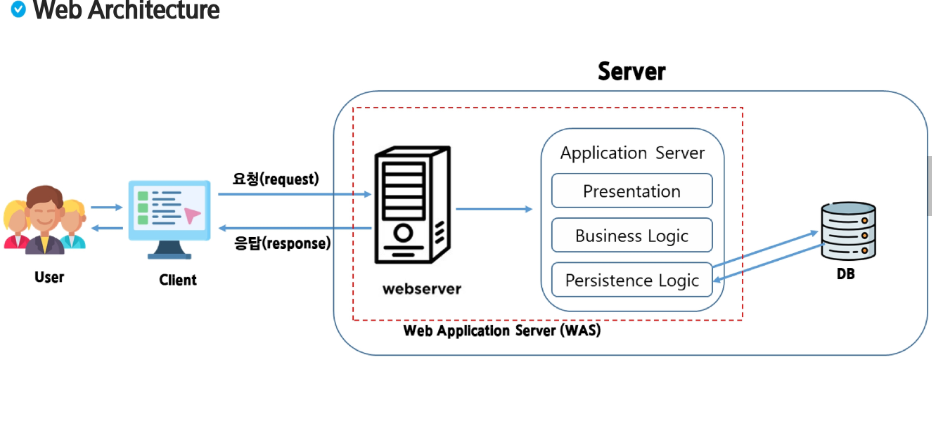

# Servlet

### 웹과 웹 프로그래밍

- URL(Uniform Resource Locator) - 웹 상의 자원을 참조하기 위한 웹 주소
- 웹 페이지(Web page) - 웹 브라우저를 통해서 보여지는 화면
- 웹 서버(Web server) - 클라이언트 요청에 맞는 응답(웹 페이지)을 제공
- 웹 어플리케이션(Web Application) - 웹 서버를 기반으로 실행되는 응용 소프트웨어
- 웹 어플리케이션 서버(Web Application Server, WAS) - 요청이 오면 알맞은 프로그램을 실행하여 응답 만들고 제공하는 서버 

> 웹 서버는 정적 페이지만 보여줄 수 있었는데, 어플리케이션 서버에 동적인 데이터를 맡기고 웹서버에 다시 돌려주고 그것을 클라이언트에 돌려준다. 아파치 재단에서 만든 Tomcat이 있다. Tomcat을 WAS로 사용한다.