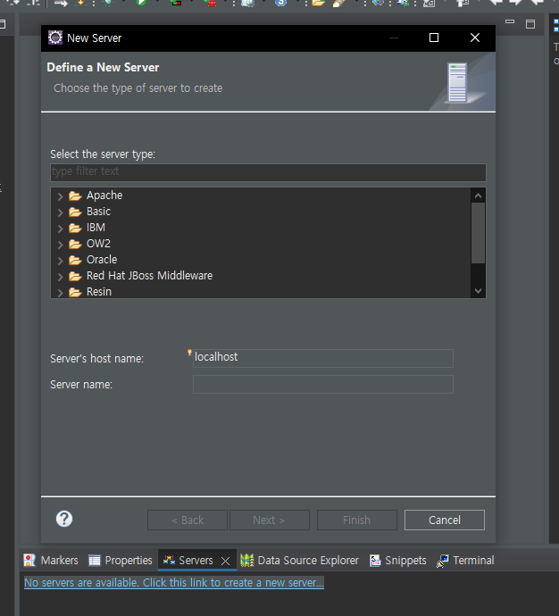

# 웹과 웹 프로그래밍

### 웹과 웹 프로그래밍

- URL(Uniform Resource Locator) - 웹 상의 자원을 참조하기 위한 웹 주소
- 웹 페이지(Web page) - 웹 브라우저를 통해서 보여지는 화면
- 웹 서버(Web server) - 클라이언트 요청에 맞는 응답(웹 페이지)을 제공
- 웹 어플리케이션(Web Application) - 웹 서버를 기반으로 실행되는 응용 소프트웨어
- 웹 어플리케이션 서버(Web Application Server, WAS) - 요청이 오면 알맞은 프로그램을 실행하여 응답 만들고 제공하는 서버 

> 웹 서버는 정적 페이지만 보여줄 수 있었는데, 어플리케이션 서버에 동적인 데이터를 맡기고 웹서버에 다시 돌려주고 그것을 클라이언트에 돌려준다. 아파치 재단에서 만든 Tomcat이 있다. Tomcat을 WAS로 사용한다.

> 이 버전을 사용하면 시스템에 서버를 계속 돌린다. 아닌 경우 zip을 연다

> tomcat이 WAS이다. DB에도 연결시켜 줌.

- 워크스페이스를 만들면 제일 먼저 인코딩을 해줘야함.
  - Window -> Preference -> enco를 친다음 UTF-8로 모두 바꿔주기

> Tomcat에 자동으로 올려달라고 요청하기 위해 설정해야함. 그런데 귀찮아서 미리 서버를 등록하고 갈거임

> file -> New -> other -> server입력 후 눌러줘도 좋고

> 이것과 같이 콘솔 창에 servers를 클릭해서 만들 수 있음-> apach -> tomcat 버전을 누르고 -> 설치 위치를 입력해주면 완성

> catalina는 tomcat9버전의 이름과 같은 거고 web.xml에서 제일 밑을 보면 index.html 등이 있는데 실행했을 때 저것들이 있으면 띄워주겠다는 의미임

> 이제는 dynamic web 을 실행하면 잘 잡혀있음

> 웹어플리케이션 작업을 Java Resources에서 할 예정

> Dynamic Web module 버전이 2.0에서 4.0으로 넘어가면서 web.xml을 안 만들어줘도 된다.

⛔ JRE Library가 unbound된 오류 발생!!

-> 프로젝트 우클릭 -> Build path -> Libraries -> classpath를 누르고 add library를 해준다.

> HttpServelet 안에 doGet 메서드가 있어서 그걸 오버라이딩하라는 의미

> 요청이 웹서버로 가고 동적으로 가공해야해서 웹 어플리케이션으로 간 뒤 처리해주고 웹 서버로 보내서 크롬에 응답이 온다

