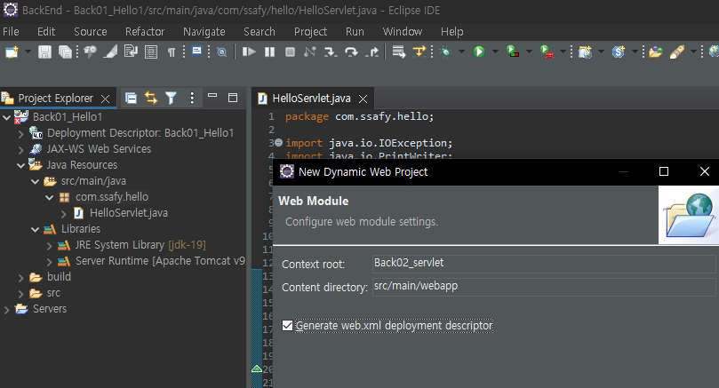

# Servlet

### Servlet의 정의

- 자바를 사용하여 웹페이지를 동적으로 생성하는 서버측 프로그램 혹은 그 사양
- 웹 서버의 성능을 향상하기 위해 사용되는 자바 클래스의 일종
- 웹 기반 응용 프로그램을 구축하기 위한 구성 요소 기반의 플랫폼 독립적 방법을 제공
- 대화형 웹 응용 프로그램을 구축하는 데 널리 사용
- JSP와 비슷한 점이 있지만, JSP가 HTML문서 안에 Java 코드를 포함
- 서블릿은 자바 코드 안에 HTML을 포함

> `sevlet`은 `main` 메서드가 아닌 `service`메서드를 활용 -> 자동적으로 doxxx 로 변환됨

```java
package com.ssafy.hello;

import java.io.IOException;
import java.io.PrintWriter;

import javax.servlet.ServletException;
import javax.servlet.annotation.WebServlet;
import javax.servlet.http.HttpServlet;
import javax.servlet.http.HttpServletRequest;
import javax.servlet.http.HttpServletResponse;


/**
 * Servlet implementation class HelloServlet
 */
@WebServlet("/HelloServlet")
public class HelloServlet extends HttpServlet {
	private static final long serialVersionUID = 1L;
       
	protected void doGet(HttpServletRequest request, HttpServletResponse response) throws ServletException, IOException {
		PrintWriter writer = response.getWriter();
		
		writer.append("<html>");
		writer.append("<head>");
		writer.append("<title>Hello</title>");		
		writer.append("</head>");
		writer.append("<body>");
		writer.append("<h1>Hello Servlet!</h1>");
		writer.append("</body>");
		writer.append("</html>");
	}
}
```





> 우리가 수정하지 않으면 Context root는 프로젝트 이름으로 되어 있고, Spring Boot에는 기본적으로 `/` 하나만 존재


> servlet을 등록할 것이다. servlet class 어디에 있는지 적어서 연결시켜주고, servlet 이름은 Hello로 지어준다.
>
> web.xml에 이름만 등록한 것이라서 맵핑을 시켜줘야함.


> `Servlet`은 하나의 클래스이므로 인스턴스를 만들어서 실행해 주어야 한다. 인스턴스를 제어하는 것을 Servlet Container가 한다. `Tomcat`이라고 생각해주면 됨. 인스턴스는 한번만 만들어진다.


```java
package com.ssafy.hello;

import java.io.IOException;
import javax.servlet.ServletConfig;
import javax.servlet.ServletException;
import javax.servlet.annotation.WebServlet;
import javax.servlet.http.HttpServlet;
import javax.servlet.http.HttpServletRequest;
import javax.servlet.http.HttpServletResponse;

/**
 * Servlet implementation class LifeCycle
 */
@WebServlet("/LifeCycle")
public class LifeCycle extends HttpServlet {
	private static final long serialVersionUID = 1L;
       
	int initCnt = 1;
	int doGetCnt = 1;
	int destroyCnt = 1;
	/**
	 * @see Servlet#init(ServletConfig)
	 */
	public void init(ServletConfig config) throws ServletException {
		System.out.println("init method call: " + initCnt++);
	}

	/**
	 * @see Servlet#destroy()
	 */
	public void destroy() {
		System.out.println("destroy method call: " + destroyCnt++);
	}

	/**
	 * @see HttpServlet#doGet(HttpServletRequest request, HttpServletResponse response)
	 */
	protected void doGet(HttpServletRequest request, HttpServletResponse response) throws ServletException, IOException {
		System.out.println("doGet method call: " + doGetCnt++);
		response.getWriter().append("Served at: ").append(request.getContextPath());
	}

}
```

> 서버를 키면 `init`과 `doGet` 메서드가 실행이 되고, 그 후에 웹 페이지에서 새로고침을 눌러도 `init`은 실행되지 않는다. 인스턴스가 만들어지고 난 후에 다시 생성이 되지 않는다는 뜻이고, 서버를 종료시키면 `destroy` 메서드가 실행된다.
>
> `init`에서는 내가 관리를 하고 싶은 것들을 넣고, `destroy`에서 자원을 반납하는 행위들, `doGet`은 알아서 요청을 처리하는 방식


> https에서 s는 `secure`이다.


> 이름과 나이는 현재 `name`이 없어서 서버가 받을 수 없음. `radio`에는 `value`도 없어서 `on`으로 넘어감