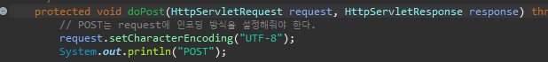
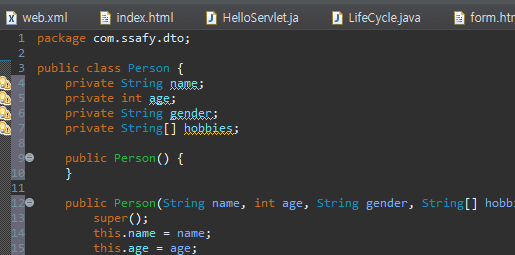
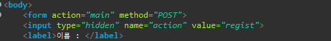
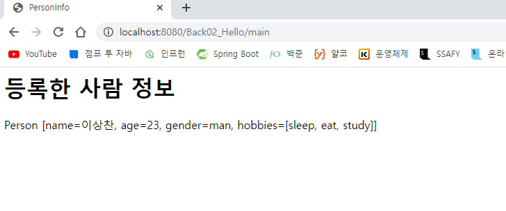
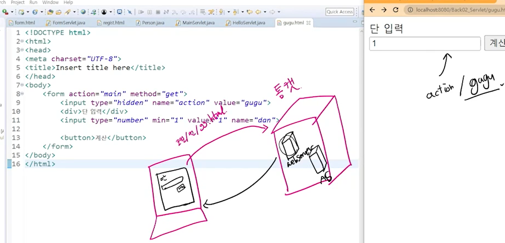

# Servlet

```html
<!DOCTYPE html>
<html>
<head>
<meta charset="UTF-8">
<title>Insert title here</title>
</head>
<body>
  <form action="FormServlet" method="GET">
  	<label>이름 : </label>
  	<input type="text" placeholder="이름을 입력하세요" name="name"> <br>
  	<label>나이 : </label>
  	<input type="number" min="0" placeholder="나이을 입력하세요" name="age"> <br>
  	<input type="radio" name="gender" id="man" value="man">
  	<label for="man">남자</label>
  	<input type="radio" name="gender" id="woman" value="woman">
  	<label for="woman">여자</label>
  	
  	<input type="submit">
  </form>
</body>
</html>
```

```java
package com.ssafy.servlet;

import java.io.IOException;
import javax.servlet.ServletException;
import javax.servlet.annotation.WebServlet;
import javax.servlet.http.HttpServlet;
import javax.servlet.http.HttpServletRequest;
import javax.servlet.http.HttpServletResponse;

/**
 * Servlet implementation class FormServlet
 */
@WebServlet("/FormServlet")
public class FormServlet extends HttpServlet {
	private static final long serialVersionUID = 1L;

	/**
	 * @see HttpServlet#doGet(HttpServletRequest request, HttpServletResponse response)
	 */
	protected void doGet(HttpServletRequest request, HttpServletResponse response) throws ServletException, IOException {
		System.out.println("GET");
		System.out.println(request.getParameter("name"));
		System.out.println(request.getParameter("age"));
		System.out.println(request.getParameter("gender"));
		
		String name = request.getParameter("name");
		// request.getParameter는 기본이 String이라서 Integer.parseInt()를 사용해야한다.
		int age = Integer.parseInt(request.getParameter("age"));
		String gender = request.getParameter("gender");
	}

	/**
	 * @see HttpServlet#doPost(HttpServletRequest request, HttpServletResponse response)
	 */
	protected void doPost(HttpServletRequest request, HttpServletResponse response) throws ServletException, IOException {
		// TODO Auto-generated method stub
		doGet(request, response);
	}

}
```

- 나이를 입력하지 않으면 Inter에 인자가 null이 들어가서 에러가 뜬다
  1. `JS`를 이용해서 안 넣으면 제출 못하게 막기
  2. `java`내에서 조건문으로 이용

- `POST` 형식으로 `form`을 바꾸면, `request`에 인코딩 방식을 기입해주어야 한다.




- `dto` : `data transfer object` 데이터를 전달하는 용도



- 하나의 서블릿으로 처리하는 것을 프런트 컨트롤러 패턴이라고 한다.

- `hidden`을 사용하면 우리 눈에는 보이지 않지만 컴퓨터는 인식을 하기 때문에 `key`, `value` 형태로 `action`과 `regist`가 전달된다.





> 서블릿을 통해서 응답을 직접적으로 그림을 그려서 웹 서버에 던졌고 웹서버는 그것을 우리에게 보여줌.

```java
package com.ssafy.servlet;

import java.io.IOException;
import java.io.PrintWriter;

import javax.servlet.ServletException;
import javax.servlet.annotation.WebServlet;
import javax.servlet.http.HttpServlet;
import javax.servlet.http.HttpServletRequest;
import javax.servlet.http.HttpServletResponse;

import com.ssafy.dto.Person;

/**
 * Servlet implementation class main
 */
@WebServlet("/main")
public class MainServlet extends HttpServlet {
	
	@Override
	protected void doGet(HttpServletRequest request, HttpServletResponse response) throws ServletException, IOException {
		response.setContentType("text/html; charset=UTF-8");
		
		doProcess(request, response);
	}
	

	@Override
	protected void doPost(HttpServletRequest request, HttpServletResponse response) throws ServletException, IOException {
		request.setCharacterEncoding("UTF-8");
		doGet(request, response);
	}

	private void doProcess(HttpServletRequest request, HttpServletResponse response) throws IOException {
		String action = request.getParameter("action");
		
		switch (action) {
		case "regist":
			doRegist(request,response);
			break;
		default:
			//아무것도 아닐 때 처리
			break;
		
		}
	}


	private void doRegist(HttpServletRequest request, HttpServletResponse response) throws IOException {
		String name = request.getParameter("name");
		int age = Integer.parseInt(request.getParameter("age"));
		String gender = request.getParameter("gender");
		String[] hobbies = request.getParameterValues("hobby");
		
//		System.out.println(Arrays.toString(request.getParameterValues("hobby")));
		
		Person p = new Person(name, age, gender, hobbies);
		
		PrintWriter writer = response.getWriter();
		
		writer.append("<html>");
		writer.append("<head>");
		writer.append("<title>PersonInfo</title>");
		writer.append("</head>");
		writer.append("<body>");
		writer.append("<h1>등록한 사람 정보</h1>");
		writer.append(p.toString());
		writer.append("</body>");
		writer.append("</html>");
		
	}
}
```

```java
package com.ssafy.dto;

import java.util.Arrays;

public class Person {
	private String name;
	private int age;
	private String gender;
	private String[] hobbies;
	
	public Person() {
	}

	public Person(String name, int age, String gender, String[] hobbies) {
		super();
		this.name = name;
		this.age = age;
		this.gender = gender;
		this.hobbies = hobbies;
	}

	public String getName() {
		return name;
	}

	public void setName(String name) {
		this.name = name;
	}

	public int getAge() {
		return age;
	}

	public void setAge(int age) {
		this.age = age;
	}

	public String getGender() {
		return gender;
	}

	public void setGender(String gender) {
		this.gender = gender;
	}

	public String[] getHobbies() {
		return hobbies;
	}

	public void setHobbies(String[] hobbies) {
		this.hobbies = hobbies;
	}

	@Override
	public String toString() {
		return "Person [name=" + name + ", age=" + age + ", gender=" + gender + ", hobbies=" + Arrays.toString(hobbies)
				+ "]";
	}	
	
	
}
```

```html
<!DOCTYPE html>
<html>
<head>
<meta charset="UTF-8">
<title>Insert title here</title>
</head>
<body>
	<form action="main" method="POST">
	<input type="hidden" name="action" value="regist">
  	<label>이름 : </label>
  	<input type="text" placeholder="이름을 입력하세요" name="name"> <br>
  	<label>나이 : </label>
  	<input type="number" min="0" placeholder="나이을 입력하세요" name="age"> <br>
  	<input type="radio" name="gender" id="man" value="man">
  	<label for="man">남자</label>
  	<input type="radio" name="gender" id="woman" value="woman">
  	<label for="woman">여자</label>
  	
  	<fieldset>
  	  <legend>취미</legend>
  	  <input type="checkbox" id="sleep" name="hobby" value="sleep">
  	  <label for="sleep">수면</label>
  	  <input type="checkbox" id="eat" name="hobby" value="eat">
  	  <label for="eat">먹기</label>
  	  <input type="checkbox" id="study" name="hobby" value="study">
  	  <label for="study">공부</label>
  	  <input type="checkbox" id="jump" name="hobby" value="jump">
  	  <label for="jump">점프</label>
  	</fieldset>
  	<input type="submit">
  </form>
</body>
</html>
```


### 참고



> 입력창은 webserver에서 바로 응답해준다.

```java
@WebServlet("/main")
public class MainServlet extends HttpServlet {
	
	@Override
	protected void doGet(HttpServletRequest request, HttpServletResponse response) throws ServletException, IOException {
		response.setContentType("text/html; charset=UTF-8");
		
		doProcess(request, response);
	}
	

	@Override
	protected void doPost(HttpServletRequest request, HttpServletResponse response) throws ServletException, IOException {
		request.setCharacterEncoding("UTF-8");
		doGet(request, response);
	}

	private void doProcess(HttpServletRequest request, HttpServletResponse response) throws IOException {
		String action = request.getParameter("action");
		System.out.println("까꿍!!");
		switch (action) {
		case "regist":
			doRegist(request,response);
			break;
		default:
			//아무것도 아닐 때 처리
			doGuGu(request, response);
			break;
		
		}
	}


	private void doGuGu(HttpServletRequest request, HttpServletResponse response) throws IOException {
		int num = Integer.parseInt(request.getParameter("num"));
		
		PrintWriter writer = response.getWriter();
		
		writer.append("<html>");
		writer.append("<head>");
		writer.append("<title>구구단</title>");
		writer.append("</head>");
		writer.append("<body>");
		writer.append("<h1>구구단</h1>");
		for (int i = 1; i < 10; i++) {
			writer.printf("%d * %d = %d<br>", num, i, num * i);
		}
		writer.append("</body>");
		writer.append("</html>");
		
		
	}
```

```html
<!DOCTYPE html>
<html>
<head>
<meta charset="UTF-8">
<title>Insert title here</title>
</head>
<body>
	<form action="main" method="POST">
		<input type="hidden" name="action" value="gugu">
		<label for="num">구구단 시작!!!</label>
		<input type="number" min = "1" value = "1" id="num" name="num" placeholder="숫자를 입력하세요.">
		
		<input type="submit">
	</form>
</body>
</html>
```

