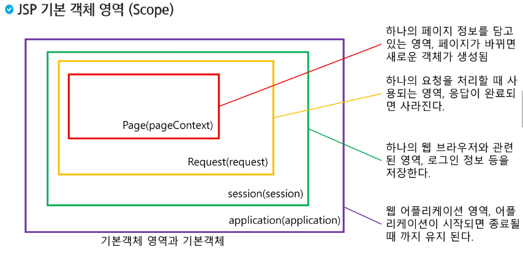

# JSP 스크립트요소

### JSP로 구구단 만들기

```java
<%@ page language="java" contentType="text/html; charset=UTF-8"
    pageEncoding="UTF-8"%>
<!DOCTYPE html>
<html>
<head>
<meta charset="UTF-8">
<title>구구단</title>
</head>
<body>
	<h1>구구단</h1>
	<%
	for (int i = 2; i < 10; i++) {
		for (int j = 1; j < 10;j++) {
			out.print(i + " * " + j + " = " + (i * j));
			out.print("<br>");
		}
	}
	
	%>
</body>
</html>
```


> 이렇게 중간에 쪼개서 HTML 문법을 쓰는 경우도 종종 있다. `<% %>`내에서는 자바 코드라서 주석도 `//`로 쓸 수 있다.
>
> `HTML` 주석은 `<!-- -->`로 되어 있다.
>
> `JSP`주석은 `<%-- --%>`로 되어 있다.


> 주석을 남길 때에 HTML은 F12에 흔적이 남는다. JSP 주석은 흔적이 남지 않는다. 서블릿으로 바뀌면서 사라지기 때문이다.


- `JSP`에서 `Import`하기 `<%@ page import="java.util.Calendar" %>`


> 세미콜론(;)을 쓰면 안된다.

```jsp
<%@ page language="java" contentType="text/html; charset=UTF-8"
    pageEncoding="UTF-8"%>
<%@ page import="java.util.Calendar" %>

<!DOCTYPE html>
<html>
<head>
<meta charset="UTF-8">
<title>Insert title here</title>
</head>
<body>
	<%
		Calendar date = Calendar.getInstance();
	%>
	
	<%= date.getTime() %>
	<%= date.get(Calendar.YEAR) %>년
	<%= date.get(Calendar.MONTH)+1 %>월
	<%= date.get(Calendar.DAY_OF_MONTH) %>일 입니다.
</body>
</html>
```





```jsp
<%= request.getContextPath() %> 는 나중에 a태그 활용 시 변수에 넣어서 context path로 사용할 수 있다.
```

```jsp
<%@ page language="java" contentType="text/html; charset=UTF-8"
    pageEncoding="UTF-8"%>
<!DOCTYPE html>
<html>
<head>
<meta charset="UTF-8">
<title>기본 객체 영역</title>
</head>
<body>
	<h2>Scope</h2>
	<%= request.getContextPath() %>
	
	<%= request.getParameter("name") %> <br>
	
	<a href="/Back03_JSP/gugu.jsp">구구단</a>
</body>
</html>
```

> `<%= request.getParameter("name") %>`은 url 주소에 쿼리명에 값을 넣어주면 페이지에 입력된다.

