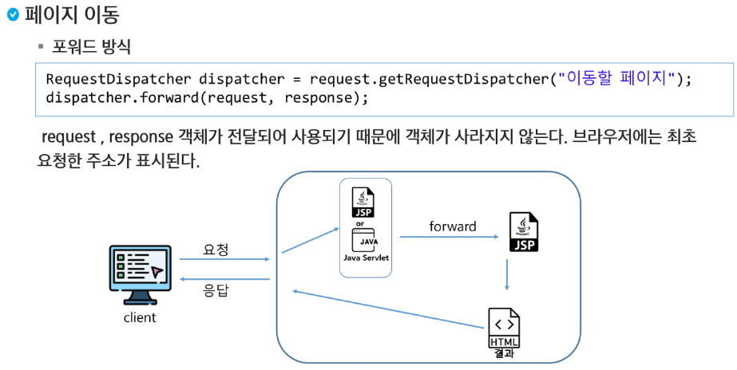

# 페이지 이동

### 페이지 이동 방법

- 포워드 방식
  - 요청이 들어오면 요청을 받은 JSP 또는 Servlet이 직접 응답을 작성하지 않고, 요청을 서버 내부에서 전달하여 해당 요청을 처리하게 하는 방식
  - 페이지는 변경되지만, URL이 변경되지 않음, 요청과 응답이 그대로 유지
- 리다이렉트 방식
  - 요청이 들어오면 내부 로직 실행 후, 브라우저의 URL을 변경하도록 하여 새로운 요청을 생성 하므로서 페이지를 이동한다.
  - `request`와 `response`가 초기화 된다.



> 요청을 유지하기 위해서 `request` 안의 `getRequestDispatcher`를 활용


> 화면의 URL이 변경된다.


> 프런트 컨트롤러 패턴: 컨트롤러 하나로 모든 요청을 처리한다.


> 요청을 받은 것들로 `Servlet`에서 처리를 하고 `result.jsp`에 `person`과 `size`속성을 넣어서 보내준다.


> `getAttribute`로 속성을 가져오고, `Object`를 형 변환 시켜준다.

```jsp
<%@ page language="java" contentType="text/html; charset=UTF-8"
    pageEncoding="UTF-8"%>
<%@ page import="com.ssafy.dto.Person" %>
<%@ page import="java.util.Arrays" %>
<!DOCTYPE html>
<html>
<head>
<meta charset="UTF-8">
<title>등록결과</title>
</head>
<body>
	<h2>등록 결과</h2>
	<%
	Person p = (Person) request.getAttribute("person");
	%>
	
	<p>등록된 총인원: <%= request.getAttribute("size") %>명</p>
	
	<table>
	  <tr>
	    <td>이름</td>
	    <td><%= p.getName() %></td>
	  </tr>
	  <tr>
	    <td>나이</td>
	    <td><%= p.getAge() %></td>
	  </tr>
	  <tr>
	    <td>성별</td>
	    <td><%= p.getGender() %></td>
	  </tr>
	  <tr>
	    <td>취미</td>
	    <td><%= Arrays.toString(p.getHobbies()) %></td>
	  </tr>
	
	</table>
	
</body>
</html>
```

```java
package com.ssafy.manager;

import java.util.ArrayList;
import java.util.List;

import com.ssafy.dto.Person;

public class PersonManager {
	
	private List<Person> list = new ArrayList<Person>();
	
	// 싱글턴 패턴을 이용하여 manager 만들고 쓸 수 있도록 했다.
	private static PersonManager manager = new PersonManager();
	
	private PersonManager() {
	}
	
	public static PersonManager getInstance() {
		return manager;
	}
	
	//등록
	public void regist(Person p) {
		list.add(p);
	}
	
	//리스트 몽땅(getter)
	public List<Person> getList() {
		return list;
	}
	
}
```

