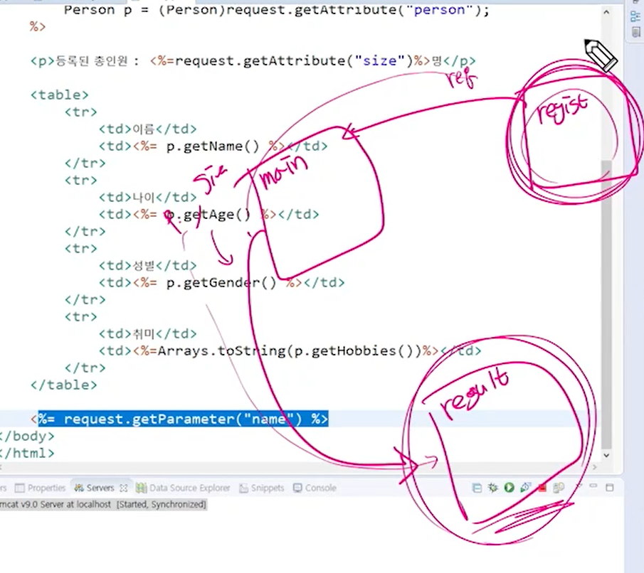
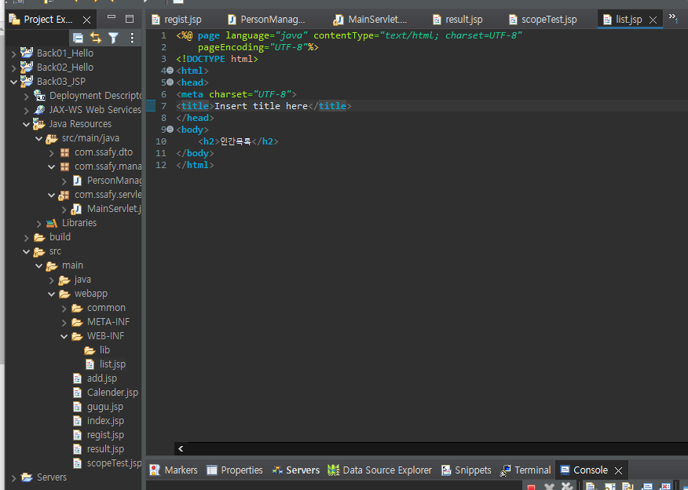
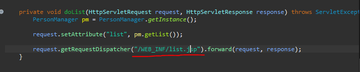
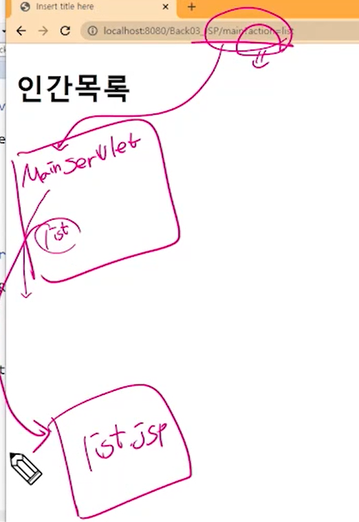
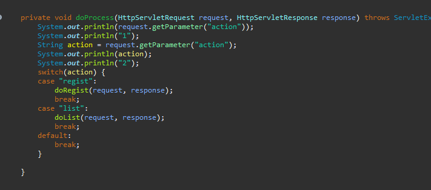

# JSP 페이지 간 이동



> `regitst`에서 `request` 정보가 그대로 넘어가서 `main`에서 `size`와 `p`가 추가된 뒤 `result`로 가져왔기 때문에 `request`에 모든 정보를 담고 있다.


```java
	private void doRegist(HttpServletRequest request, HttpServletResponse response) throws ServletException, IOException {
		String name = request.getParameter("name");
		int age = Integer.parseInt(request.getParameter("age"));
		String gender = request.getParameter("gender");
		String[] hobbies = request.getParameterValues("hobby");
		
		Person p = new Person(name, age, gender, hobbies);
		
		PersonManager pm = PersonManager.getInstance();
		pm.regist(p);
		
		// 요청 객체에 생성한 인스턴스를 집어 넣는다.
		request.setAttribute("person", p);
		request.setAttribute("size", pm.getList().size());
		
		// requestDispatcher에서 /를 쓰면 얘는 컨텍스트패스까지 경로를 포함한다.
//		RequestDispatcher disp = request.getRequestDispatcher("/result.jsp");
//		disp.forward(request, response);
		
		// 여기서 /는 포트 번호까지만 가져옴.
		response.sendRedirect(request.getContextPath() + "/result.jsp");
}
}
```

> `Redirect`시에는 `request`의 정보가 지워지고 넘어가므로 등록할 때에는 사용하지 않는 것이 좋다. 대신 세션의 영역에 담아놓아야 한다.




> `WEB_INF`는 외부에서 접근이 불가능하다. 비공개 폴더이다. `localhost:8080/Back03_JSP/WEB_INF/list.jsp`로 들어갈 수 없다. 내부에서 `Servlet`을 통해서만 접근할 수 있게 만든다.







> `MainServlet`에서 `list`를 확인했고, `list.jsp`로 이동을 했다.

```jsp
<%@ page language="java" contentType="text/html; charset=UTF-8"
    pageEncoding="UTF-8"%>
<%@ page import="java.util.ArrayList" %>
<%@ page import="com.ssafy.dto.Person" %>
<!DOCTYPE html>
<html>
<head>
<meta charset="UTF-8">
<title>Insert title here</title>
</head>
<body>
	<h2>인간목록</h2>
	<%
	ArrayList<Person> list = (ArrayList<Person>) request.getAttribute("list");
	for(int i = 0; i < list.size(); i++) {
		out.print(list.get(i).getName() + "<br>");
	}
	%>
</body>
</html>
```

> `for`문을 활용해서 보여줘야 하지만, 나중에 EL/JSTL을 통해 더욱 쉽게 표현할 수 있다.