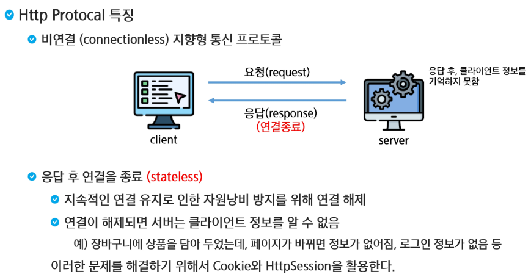
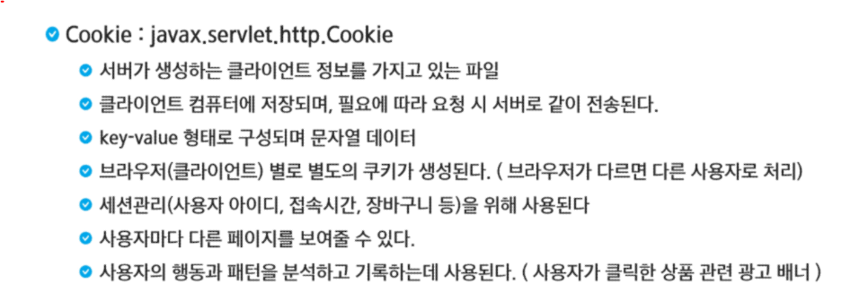
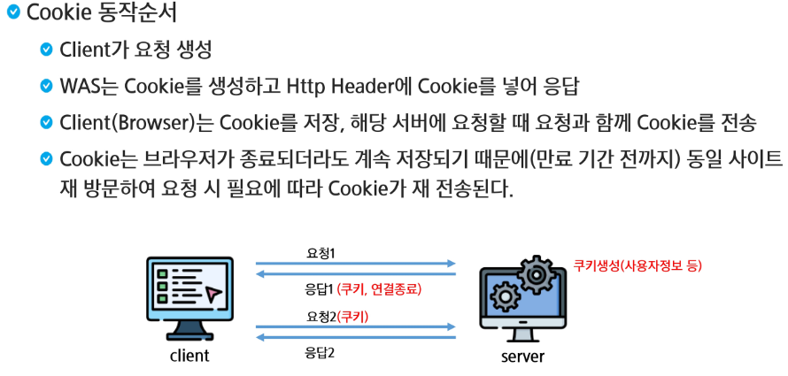
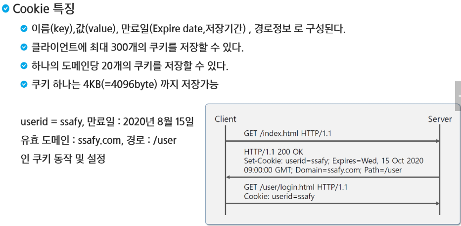
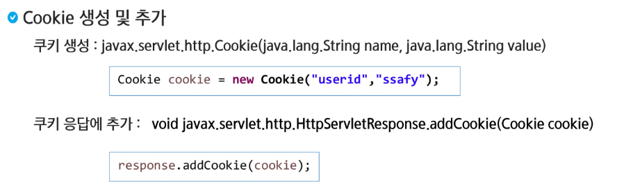
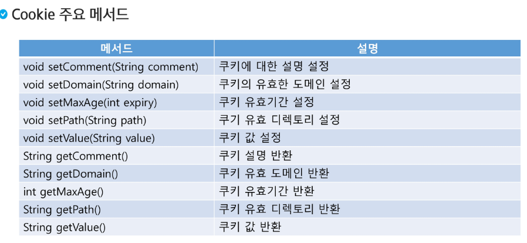
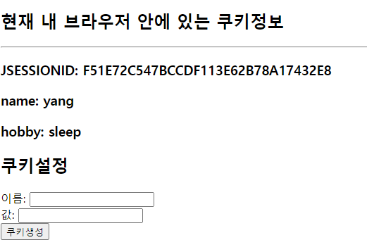

# Cookie









> 이미지는 주소를 가지고 있다.





> setMaxAge는 알고 가는 것이 중요하다

⛔새로운 환경에 갔을 때 서버가 만들어지지 않는다면, Tomcat의 버전과 위치가 다를 수 있다. 전부 삭제 후 다시 만들어주는 것이 중요.

```java
package com.ssafy.cookie;

import javax.servlet.annotation.WebServlet;
import javax.servlet.http.HttpServlet;

// 서블릿으로 업그레이드 시키고
// 쿠기를 한번 만들어 보자.
@WebServlet("/make")
public class MakeCookie extends HttpServlet{
	
}
```

> `Class`를 `Servlet`으로 만들어주는 방법. `HttpServlet`을 먼저 등록하고, `Web.xml`에 `Servlet`을 등록하기 번거로워서 `WebServlet` `Annotation`을 활용한다.
>
> 클래스가 실행되면, 생성자를 통해서 인스턴스가 먼저 만들어지고 `Init` 메서드를 실행한다.

- `Alt`+`Shift`+`R`을 누르면 같은 단어들이 선택되어진다.


### Cookie 만들기

- `Cookie`라는 참조 변수를 활용할 수 있다.

```java
// 자바 문서 읽어보기
https://javaee.github.io/javaee-spec/javadocs/
```

```java
package com.ssafy.cookie;

import java.io.IOException;

import javax.servlet.ServletException;
import javax.servlet.annotation.WebServlet;
import javax.servlet.http.Cookie;
import javax.servlet.http.HttpServlet;
import javax.servlet.http.HttpServletRequest;
import javax.servlet.http.HttpServletResponse;

// 서블릿으로 업그레이드 시키고
// 쿠기를 한번 만들어 보자.
@WebServlet("/make")
public class MakeCookie extends HttpServlet{
	@Override
	protected void doGet(HttpServletRequest request, HttpServletResponse response) throws ServletException, IOException {
		String key = request.getParameter("key");
		String value = request.getParameter("value");
		
//		System.out.println(key);
//		System.out.println(value);
		
		//쿠키 생성
		Cookie cookie = new Cookie(key, value);
		
		//유효시간(만료 기간) 초단위
		cookie.setMaxAge(60); //1분
		
		//쿠키라고 하는 것은 직접 우리가 설정으로 지울 수는 없을까?
//		cookie.setMaxAge(0); // 이렇게 쓰는 것이 쿠키 삭제와 동일하다.
		
		response.addCookie(cookie);
		
		response.sendRedirect("cookie1.jsp");
	}
}

```


### Cookie 불러오기

- Cookie라는 배열을 불러와서 사용한다.



```java
<%@ page language="java" contentType="text/html; charset=UTF-8"
    pageEncoding="UTF-8"%>
<!DOCTYPE html>
<html>
<head>
<meta charset="UTF-8">
<title>Insert title here</title>
</head>
<body>
	<h2>현재 내 브라우저 안에 있는 쿠키정보</h2>
	<hr>
	<%
		Cookie[] cookies = request.getCookies();
		if (cookies != null) {
			for (Cookie c : cookies) {
				String key = c.getName();
				String value = c.getValue();
				%>
				<h3><%=key %>: <%=value %></h3>
				<%
			}
		} else {
			out.print("설정된 쿠키가 없습니다.");
		}
	%>
	<h2>쿠키설정</h2>
	  <form action="make" method="get">
	  이름: <input type="text" name="key"><br>
	  값: <input type="text" name="value"><br>
	  <input type="submit" value="쿠키생성">
	</form>
</body>
</html>
```

