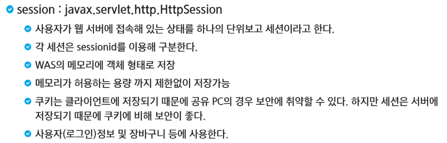
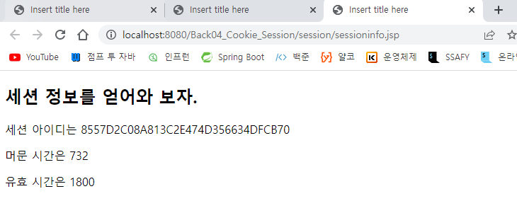

# HttpSession

- `Cookie`는 class 였지만, `HttpSession`은 인터페이스이다.




> 세션을 지울 때 `invalidate`나 `removeAttribute`를 사용한다.


> Page: 페이지 안에서 데이터를 쓰고 지우고
>
> request: 요청이 있을 때 그 정보를 넣고 빼고
>
> session: 하나의 브라우저에서 데이터를 쓰고 지우고
>
> application: 서버에 프로젝트가 살아있는 동안 가지고 있는 정보

- `pageContext`, `request`, `session`, `application`은 JSP의 기본 객체이다.

```jsp
<%@ page language="java" contentType="text/html; charset=UTF-8"
    pageEncoding="UTF-8"%>
<!DOCTYPE html>
<html>
<head>
<meta charset="UTF-8">
<title>Insert title here</title>
</head>
<body>
	<%
		pageContext.setAttribute("name", "page yang");
		request.setAttribute("name", "request yang");
		session.setAttribute("name", "session yang");
		application.setAttribute("name", "application yang");
		
		System.out.print("A.jsp");
		System.out.print("페이지 속성" + pageContext.getAttribute("name"));
		System.out.print("요청 속성" + request.getAttribute("name"));
		System.out.print("세션 속성" + session.getAttribute("name"));
		System.out.print("어플리케이션 속성" + application.getAttribute("name"));
		
		request.getRequestDispatcher("B.jsp").forward(request, response);
	%>
</body>
</html>
```

> `JSP`도 `Servlet`이기 때문에 `B.jsp`로 현재의 `request`와 `response`를 유지해서 날리겠다.

- `forward` 방식 때문에 `A.jsp`의 `URL`을 유지한 채 `B.jsp`가 실행된다. 이때 `pageContext`는 해당 페이지 내에서만 실행되기 때문에 `null`값을 반환하고 나머지는 데이터를 들고 이동한다.


```jsp
//B.jsp
<%@ page language="java" contentType="text/html; charset=UTF-8"
    pageEncoding="UTF-8"%>
<!DOCTYPE html>
<html>
<head>
<meta charset="UTF-8">
<title>Insert title here</title>
</head>
<body>
	<p>페이지 속성: <%= pageContext.getAttribute("name") %></p>
	<p>요청 속성: <%= request.getAttribute("name") %></p>
	<p>세션 속성: <%= session.getAttribute("name") %></p>
	<p>페이지 속성: <%= application.getAttribute("name") %></p>
	
	<a href="C.jsp">세번째 페이지</a>
</body>
</html>
```


- C.jsp
  - 새롭게 요청을 날리는 것과 같으므로 session과 application만 남는다.
  - session은 브라우저 단위
  - application은 서버가 꺼지지 않아서


```jsp
<%@ page language="java" contentType="text/html; charset=UTF-8"
    pageEncoding="UTF-8"%>
<!DOCTYPE html>
<html>
<head>
<meta charset="UTF-8">
<title>Insert title here</title>
</head>
<body>
	<p>페이지 속성: <%= pageContext.getAttribute("name") %></p>
	<p>요청 속성: <%= request.getAttribute("name") %></p>
	<p>세션 속성: <%= session.getAttribute("name") %></p>
	<p>페이지 속성: <%= application.getAttribute("name") %></p>
	
	<a href="C.jsp">세번째 페이지</a>
</body>
</html>
```

- `Ctrl`+`Shift`+`N`(시크릿모드)로 들어갈 시 세션 null로 변경
  - `application`은 톰캣에서 돌리고 있는 정보여서 사라지지 않는다.
  - 세션은 브라우저 단위이기 때문에 새로운 브라우저는 유지되지 않는다.
    - 크롬과 파이어폭스 등등


- 아래쪽 Server를 끄고 다시 킨 후에 `C.jsp`로 들어가면 `session`은 데이터가 남아있다. 왜냐하면 브라우저 하나가 아직 완전히 꺼지지 않고 유지되어 있기 때문이다.


```jsp
<%@ page language="java" contentType="text/html; charset=UTF-8"
    pageEncoding="UTF-8"%>
<!DOCTYPE html>
<html>
<head>
<meta charset="UTF-8">
<title>Insert title here</title>
</head>
<body>
	<h2>세션 정보를 얻어와 보자.</h2>
	<%
	String sessionId = session.getId();
    //세션에 마지막으로 접근한 시간
	long lastTime = session.getLastAccessedTime();
    //세션을 생성한 시간
	long createTime = session.getCreationTime();
	// 세션의 유효 시간
	session.getMaxInactiveInterval();
	
	%>
</body>
</html>
```



- `session`도 `HttpSession` 참조 변수를 활용해서 값들을 넣을 수 있다. 

```jsp
package com.ssafy.cookie;

import java.io.IOException;

import javax.servlet.ServletException;
import javax.servlet.annotation.WebServlet;
import javax.servlet.http.Cookie;
import javax.servlet.http.HttpServlet;
import javax.servlet.http.HttpServletRequest;
import javax.servlet.http.HttpServletResponse;
import javax.servlet.http.HttpSession;

// 서블릿으로 업그레이드 시키고
// 쿠기를 한번 만들어 보자.
@WebServlet("/make")
public class MakeCookie extends HttpServlet{
	@Override
	protected void doGet(HttpServletRequest request, HttpServletResponse response) throws ServletException, IOException {
		String key = request.getParameter("key");
		String value = request.getParameter("value");
		
//		System.out.println(key);
//		System.out.println(value);
		
		//쿠키 생성
		Cookie cookie = new Cookie(key, value);
		
		//유효시간(만료 기간) 초단위
		cookie.setMaxAge(60); //1분
		
		//쿠키라고 하는 것은 직접 우리가 설정으로 지울 수는 없을까?
//		cookie.setMaxAge(0); // 이렇게 쓰는 것이 쿠키 삭제와 동일하다.
		
		response.addCookie(cookie);
		
		HttpSession session = request.getSession();
		session.setAttribute("name", "hello");
		
		response.sendRedirect("cookie1.jsp");
	}
}
```

