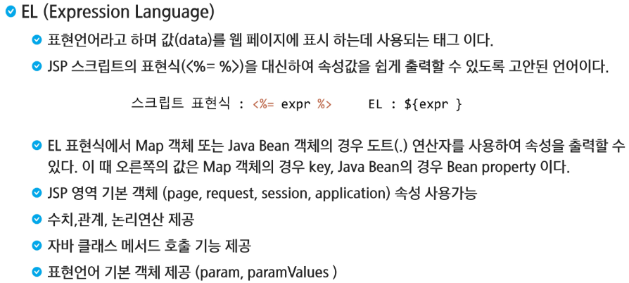

# EL(Expression Language)



> `Java Bean`은 우리가 데이터를 주고 받기 위한 바구니!로 생각하기


```jsp
<%@ page language="java" contentType="text/html; charset=UTF-8"
    pageEncoding="UTF-8"%>
<!DOCTYPE html>
<html>
<head>
<meta charset="UTF-8">
<title>Insert title here</title>
</head>
<body>
	<h2>Hello 출력</h2>
	<!-- Hello 출력 -->
	<!-- EL -->
	${"Hello"}<br>
	<!-- 표현식 -->
	<%="Hello" %><br>
	<!-- 스크립트식 -->
	<% out.print("Hello"); %><br>
</body>
</html>
```

> 가끔 이클립스 오류로 빨간 줄이 뜨기도 한다.


> 자료형도 대부분 사용가능하고, `null`같은 경우 공백을 표시해서 이점이 있다.


> `()`에 글자를 적어도 가능, 3항 연산자도 가능, `${empty name}`을 통해 `null`인지 판별가능


> name은 가장 가까운역부터 가져옴


> EL의 ==은 equals 역할을 한다.


- num1, num2, add는 forward 방식으로 넘어갔고, 그 값을 EL표현식이 page영역부터 올라가면서 request에서 찾아서 반환

```java
//Servlet
package com.ssafy.servlet;

import java.io.IOException;
import javax.servlet.ServletException;
import javax.servlet.annotation.WebServlet;
import javax.servlet.http.HttpServlet;
import javax.servlet.http.HttpServletRequest;
import javax.servlet.http.HttpServletResponse;

@WebServlet("/AddServlet")
public class AddServlet extends HttpServlet {
	private static final long serialVersionUID = 1L;

	protected void doGet(HttpServletRequest request, HttpServletResponse response) throws ServletException, IOException {
		int num1 = 10;
		int num2 = 20;
		int add = num1 + num2;
		request.setAttribute("num1", num1);
		request.setAttribute("num2", num2);
		request.setAttribute("add", add);
		
		request.getRequestDispatcher("addResult.jsp").forward(request, response);
	}

}
```

```jsp
<%@ page language="java" contentType="text/html; charset=UTF-8"
    pageEncoding="UTF-8"%>
<!DOCTYPE html>
<html>
<head>
<meta charset="UTF-8">
<title>Insert title here</title>
</head>
<body>
	${num1 } + ${num2 } = ${add }
</body>
</html>
```

