# JSTL(JSP Standar Tag Library)

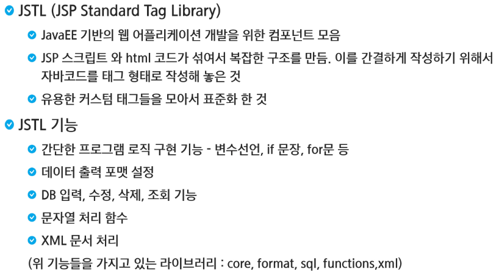

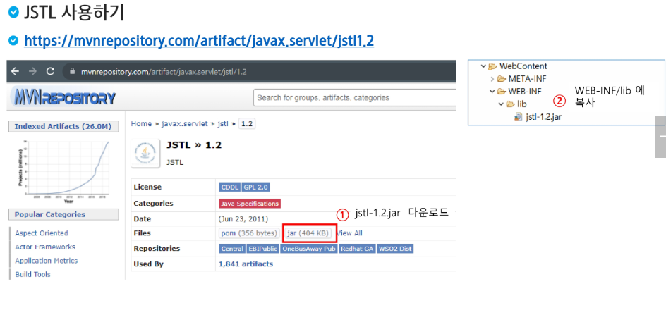

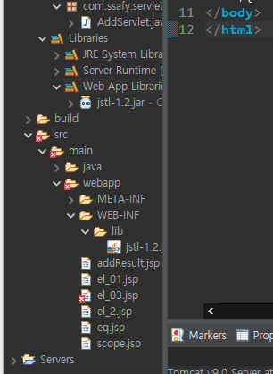

> `JSTL`은 라이브러리인데 `webapp`안에 `lib`에 `jar`파일을 집어넣으면 라이브러리 자동으로 입력됨

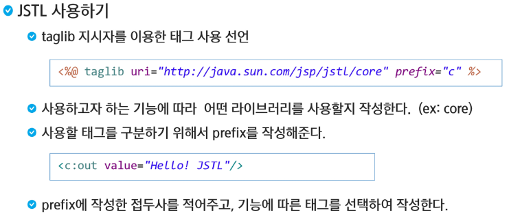

> `jar`파일에 경로가 맵핑이 되어 있다. 지시자는 `page`, `include`, `taglib`이 존재,
>
> 접두어를 `c`로 사용한다. `core`뿐만 아니라 `xml`, `sql`, `functions`등을 사용할 때는 다른 접두어 사용

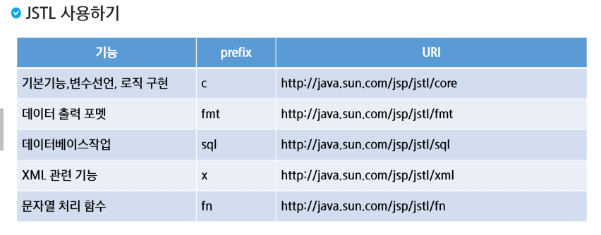

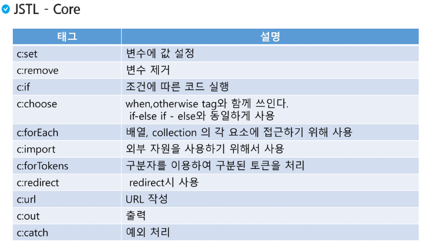

```jsp
<c:out value="Hello SSAFY"></c:out><br>
<c:out value="Hello SSAFY"/>
```

> `tag`안에 쓸 내용이 없으면 `/>`로 닫아줄 수 있다.

```jsp
<%@ page language="java" contentType="text/html; charset=UTF-8"
    pageEncoding="UTF-8"%>
<%@ taglib uri="http://java.sun.com/jsp/jstl/core" prefix="c" %>
<!DOCTYPE html>
<html>
<head>
<meta charset="UTF-8">
<title>Insert title here</title>
</head>
<body>
	<c:out value="Hello SSAFY"></c:out>
	<c:out value="Hello SSAFY"/><br>
	
	<!-- scope : 어디 영역에 변수를 선언할 건지
	     var : 변수이름
	     value : 값-->
	<c:set var="msg" value="승희 씨 사랑해요!!"/>
	${msg }<br>
	
	<c:set var="msg2">hello2</c:set>
	${msg2 }
</body>
</html>
```

> `value`를 꼭 사용하지 않아도 태그 안에 값을 적어서 보여줄 수 있다.


```jsp
<%@ page language="java" contentType="text/html; charset=UTF-8"
    pageEncoding="UTF-8"%>
<%@ taglib uri="http://java.sun.com/jsp/jstl/core" prefix="c" %>
<!DOCTYPE html>
<html>
<head>
<meta charset="UTF-8">
<title>Insert title here</title>
</head>
<body>
	<c:if test="${param.fruit==1}">
		<div style="color: red">딸기</div>
	</c:if>
	<c:if test="${param.fruit==2}">
		<div style="color: blue">수박</div>
	</c:if>
	<c:if test="${param.fruit==3}">
		<div style="color: yellow">레몬</div>
	</c:if>
	<c:if test="${param.fruit==4}">
		<div style="color: pink">사과</div>
	</c:if>

	<c:choose>
		<c:when test="${param.fruit==1}">
			<div style="color: red">딸기</div>
		</c:when>
		<c:when test="${param.fruit==2}">
			<div style="color: blue">수박</div>
		</c:when>
		<c:when test="${param.fruit==3}">
			<div style="color: yellow">레몬</div>
		</c:when>
		<c:otherwise>
			<div style="color: pink">사과</div>
		</c:otherwise>
	</c:choose>
	
</body>
</html>
```

> `if ~ else`는 `c:choose`와 `c:when`을 활용해서 만들고 `else`는 `c:otherwise`를 활용한다.

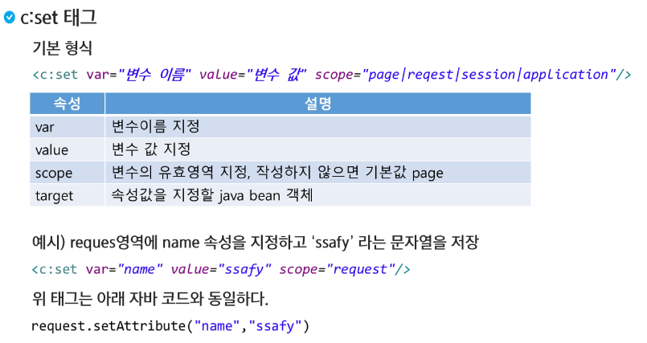

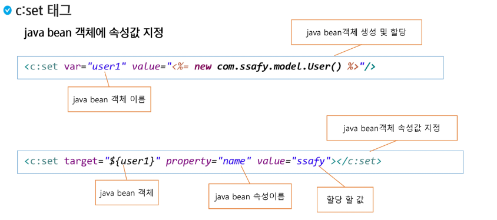

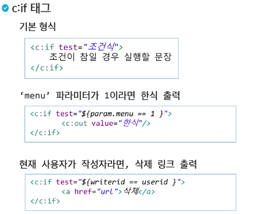

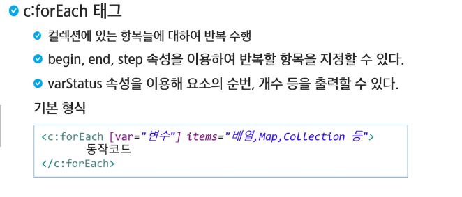

```jsp
<%@ page language="java" contentType="text/html; charset=UTF-8"
    pageEncoding="UTF-8"%>
<%@ taglib uri="http://java.sun.com/jsp/jstl/core" prefix="c" %>
<!DOCTYPE html>
<html>
<head>
<meta charset="UTF-8">
<title>Insert title here</title>
</head>
<body>
	<%
		String[] movieList = {"아바타", "올빼미", "불릿트레인", "인터스텔라", "트랜스포머"};
		pageContext.setAttribute("movieList", movieList);
	%>
	
	<c:forEach var="movie" items="${movieList}">
		${movie }<br>
	</c:forEach>
	
</body>
</html>
```

> `forEach`활용


```java
<%@ page language="java" contentType="text/html; charset=UTF-8"
    pageEncoding="UTF-8"%>
<%@ taglib uri="http://java.sun.com/jsp/jstl/core" prefix="c" %>
<!DOCTYPE html>
<html>
<head>
<meta charset="UTF-8">
<title>Insert title here</title>
</head>
<body>
	<%
		String[] movieList = {"아바타", "올빼미", "불릿트레인", "인터스텔라", "트랜스포머"};
		pageContext.setAttribute("movieList", movieList);
	%>
	<table border="1">
		<tr>
			<th>index</th>
			<th>count</th>
			<th>title</th>
		</tr>
		<c:forEach var="movie" items="${movieList}" varStatus="status" begin="1" end="2" step="1">
			<tr>
				<td>${status.index }</td>
				<td>${status.count }</td>
				<td>${movie }</td>
			</tr>
	</c:forEach>
	</table>
	
	
</body>
</html>
```

> `begin`, `end`, `step`을 활용해 인덱스의 범위를 조정할 수 있다.


- 체크박스를 활용해 여러 개의 값을 넣을 수 있다.

```jsp
<%@ page language="java" contentType="text/html; charset=UTF-8"
    pageEncoding="UTF-8"%>
<!DOCTYPE html>
<html>
<head>
<meta charset="UTF-8">
<title>Insert title here</title>
</head>
<body>
	<h2>반찬</h2>
	<form action="checkBoxResult.jsp">
		<input type="checkbox" name="dish" value="김치전"> 김치전
		<input type="checkbox" name="dish" value="계란말이"> 계란말이
		<input type="checkbox" name="dish" value="연근조림"> 연근조림<br>
		<input type="checkbox" name="dish" value="제육볶음"> 제육볶음
		<input type="checkbox" name="dish" value="소세지야채볶음"> 소세지야채볶음
		<input type="checkbox" name="dish" value="삼겹살"> 삼겹살<br>
		<input type="submit" value="구매">
	</form>
</body>
</html>
```

```jsp
<%@ page language="java" contentType="text/html; charset=UTF-8"
    pageEncoding="UTF-8"%>
<%@ taglib uri="http://java.sun.com/jsp/jstl/core" prefix="c" %>
<!DOCTYPE html>
<html>
<head>
<meta charset="UTF-8">
<title>Insert title here</title>
</head>
<body>
	<h2>오늘 나의 반찬은</h2>
	<c:forEach var="item" items="${paramValues.dish}" varStatus="status">
		${item }<c:if test="${not status.last }">,</c:if>
	</c:forEach>
</body>
</html>
```

> `status`기능에는 `first`와 `last`가 함께 있다. 처음인지 끝인지! 여러 개의 값을 받아올 때는 `paramValues`를 사용한다.

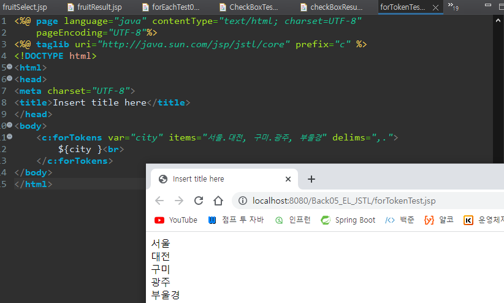


### POST방식으로 보낼 시 한글 깨짐

```jsp
<%@ page language="java" contentType="text/html; charset=UTF-8"
    pageEncoding="UTF-8"%>
<!DOCTYPE html>
<html>
<head>
<meta charset="UTF-8">
<title>Insert title here</title>
</head>
<body>
	<%
		request.setCharacterEncoding("UTF8");
	%>
	<%= request.getParameter("name") %>
</body>
</html>
```

```jsp
<%@ page language="java" contentType="text/html; charset=UTF-8"
    pageEncoding="UTF-8"%>
<!DOCTYPE html>
<html>
<head>
<meta charset="UTF-8">
<title>Insert title here</title>
</head>
<body>
	<h3>POST 방식에서 한글 깨짐</h3>
	<form action="jstlfmt_result.jsp" method="POST">

		<input type="text" name="name" palceholder="이름을 입력하세요">
		<button>제출</button>
	</form>
</body>
</html>
```


```jsp
<%@ page language="java" contentType="text/html; charset=UTF-8"
    pageEncoding="UTF-8"%>
<%@ taglib prefix="fmt" uri="http://java.sun.com/jsp/jstl/fmt" %>
<!DOCTYPE html>
<html>
<head>
<meta charset="UTF-8">
<title>Insert title here</title>
</head>
<body>
	<fmt:requestEncoding value="UTF-8"/>
	${param.name }
</body>
</html>
```

> ``jstl`을 활용한 인코딩 방식


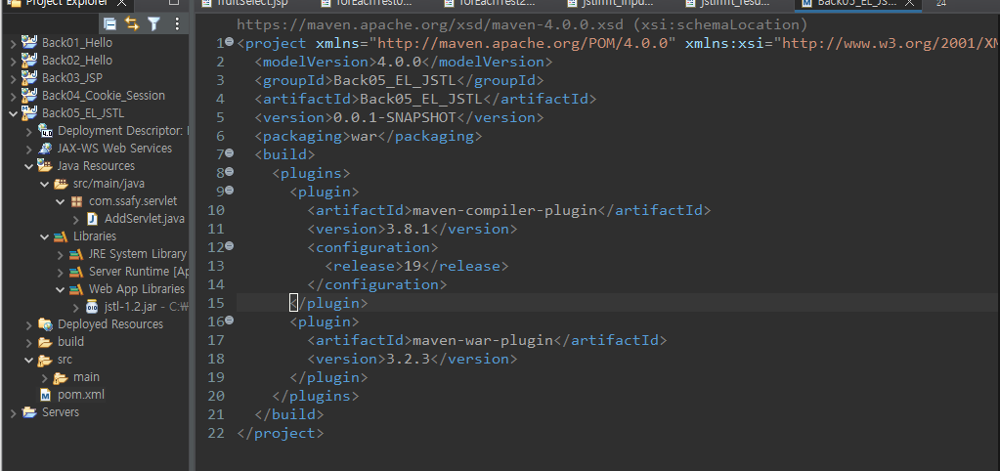

> 프로젝트 우클릭 -> `Configure` -> `Convert to Maven Project`를 누르면 `pom.xml`이 생성되고, 프로젝트에 대한 설정들이 저장되는 파일이다
>
> `jar`파일을 `Library`에 직접 넣지 않고 인터넷에서 가져오고 싶다는 설정을 넣고 싶을 때에는, `pom.xml`에 `dependencies`를 넣고 `jstl`의 `dependency`를 넣어준다. 그러면 `Maven Dependencies`아래에 파일이 자동적으로 만들어지게 되어서 따로 `jar`파일을 넣지 않아도 된다.

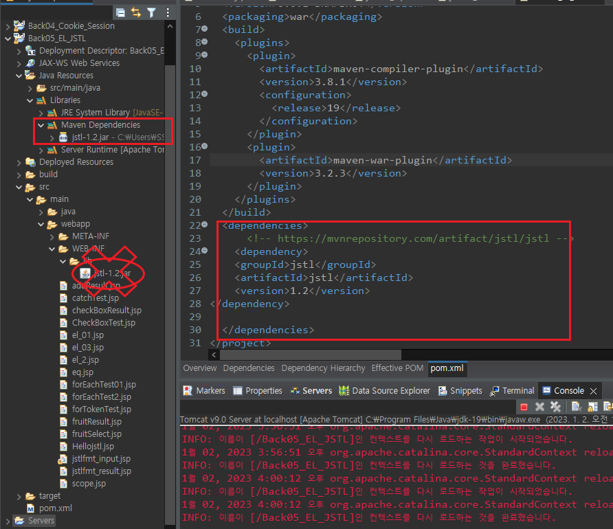


---


### ✅참고 테이블 태그

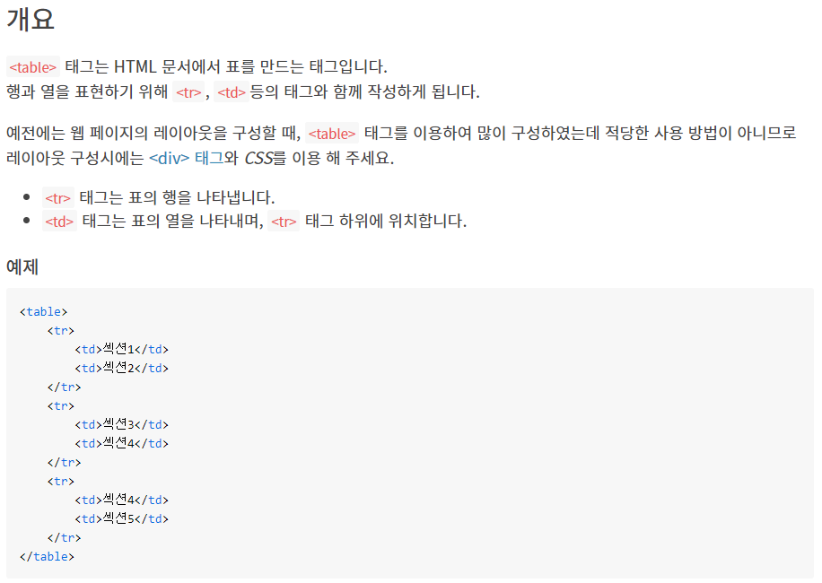

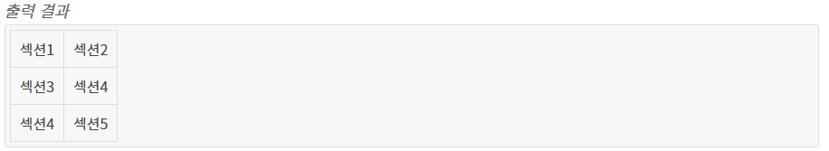

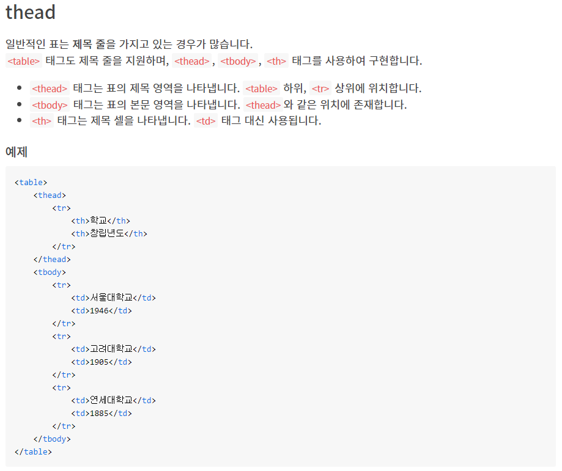

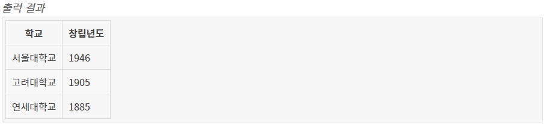

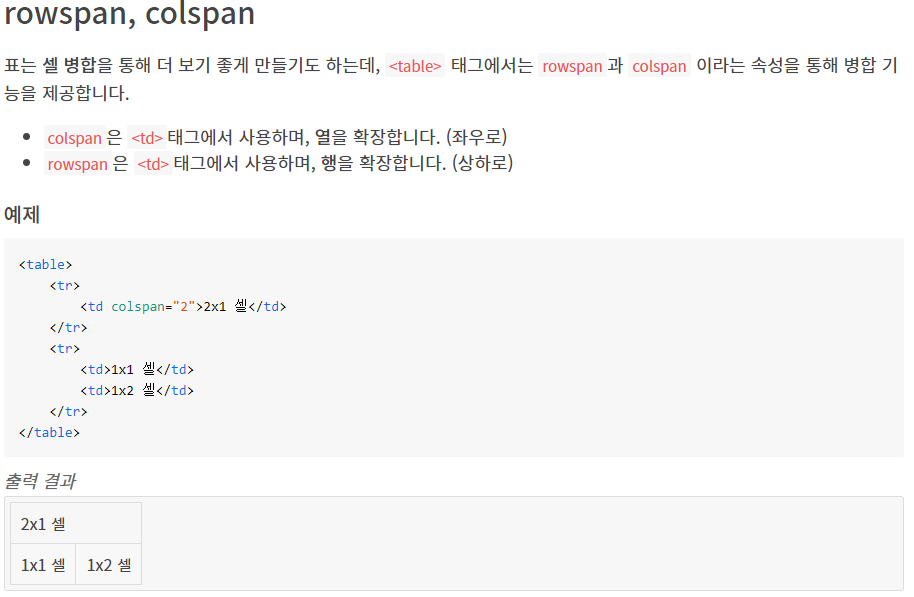

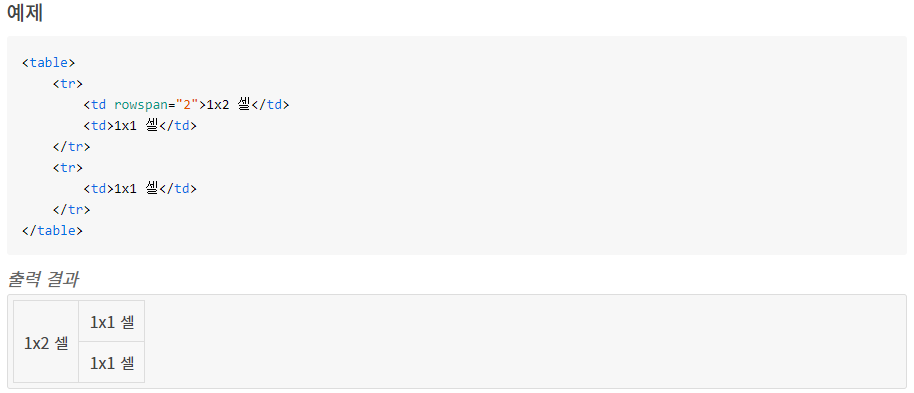