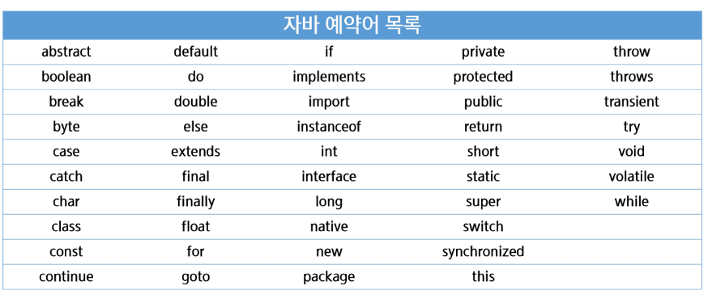
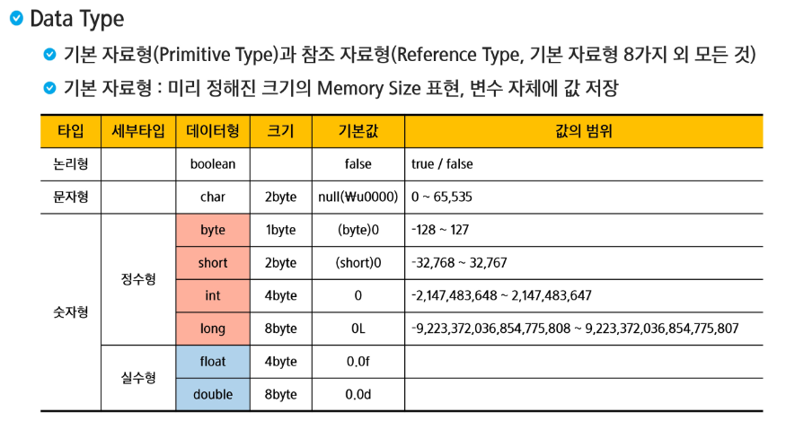

# 변수(Variable)

- 정의
  - 데이터를 저장할 메모리의 위치를 나타내는 이름
  - 메모리 상에 데이터를 보관할 수 있는 공간을 확보
  - 적절한 메모리 공간을 확보하기 위해서 변수의 타입 등장
  - `'='`를 통해서 CPU에게 연산작업을 의뢰
- 메모리의 단위
  - 0과 1을 표현하는 bit
  - 8bit = 1byte

- 특징
  - 대소문자를 구분한다
  - 공백은 허용되지 않는다
  - 숫자로 시작할 수 없다
  - $와 _변수이름에 사용할 수 있다. 이외의 특수문자는 허용하지 않는다
  - 예약어(자바문법을 위해 미리 지정되어있는 단어)는 사용할 수 없다.
  - 합성어의 경우 주로 camelCase를 활용한다.
    - PascalCase(첫글자와 연결글자도 대문자->클래스 이름)
    - camelCase(변수명, 함수명)
    - snake_case(python, 상수일 경우 대문자_대문자)
    - kebab-case(중간에 하이픈, HTML/CSS 등 속성)
  - 한글을 이용한 변수 작명 가능

> 예약어를 사용하려고 하면 보라색 표시가 난다.(절대 사용할 수 없음)

> 정수형에서 기본은 int, 실수형에서 기본은 double이다
>
> char는 음수는 안된다
>
> 나머지는 byte에 맞는 가지수가 존재(1byte = 2^8, 2byte = 2^16)
>
> 실수형은 부동소수점을 기반으로 하기 때문에 정확한 값을 표현할 수는 없다.
>
> ex) 0.1 + 0.1 + 0.1 이 0.3과 같지 않다고 나온다
>
> boolean은 JVM따라 다르게 처리되는데 1byte인 경우도 있고 비워있는 경우도 있다.