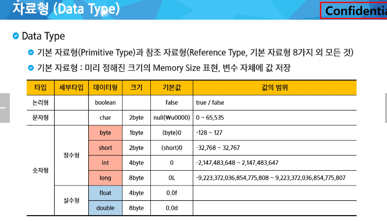
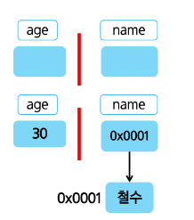
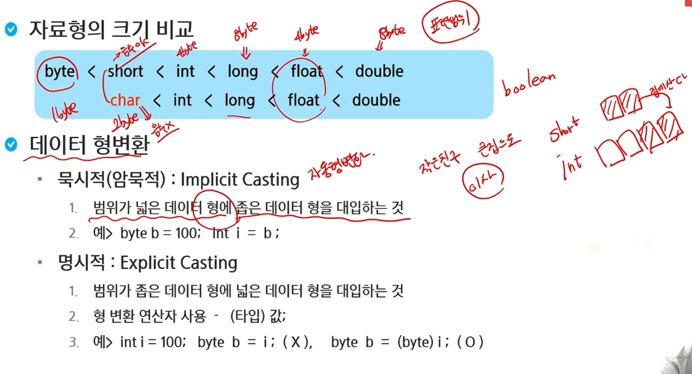

# 변수 1



> String같은 경우는 참조 자료형이다

- 선언(메모리 공간에 해당 변수에 대한 공간이 할당이 된다.)
  - 자료형 변수명;
  - int age; String name;

- 저장(할당)
  - 변수명 = 저장할 값;
  - age = 30; name = "철수";



> 기본 자료형은 공간에 바로 저장이 된다.
>
> 참조 자료형은 보관소 크기를 확정할 수 없어서, 가리키는 주소를 저장(메모리 영역이 다르다)

- 초기화(선언과 저장을 동시에 하는 것을 초기화한다라고 말한다.)
  - 자료형 변수명 = 저장할 값;
  - int age = 30;

```java
package java01.intro;

public class Var01_VariableTest {
	public static void main(String[] args) {
		int a; //선언
		a = 10; //저장
		System.out.println(a);
		int b = 20;
		System.out.println(b);
		int c = a; // 오른쪽 변수의 값을 꺼내서 왼쪽 변수에 담는다.
		System.out.println(c);
		c = b;
		System.out.println(c);
		
		System.out.printf("변수 c의 값은 %d", c);
	}
}
```



> float이 자료형의 표현 범위가 훨씬 넓다.(6자리까지 보장?, double은 15자리까지)
>
> char는 음수를 허용하지 않음
>
> 묵시적 형변환은 좁은 것을 넓은 것으로 대입할 때를 의미한다. short가 int로 이사하는 경우를 말함
>
> 명시적 형변환은 큰 범위를 좁은 곳에 넣을 때 데이터 손실이 발생할 수 있다.

```java
package java02.variable;

public class Var02_TypeCasting {
	public static void main(String[] args) {
		int a = 10;
		int b = a;
		System.out.printf("a : %d \n", a);
		System.out.printf("b : %d \n", b);
		
		a = 12;
		//b는 바뀌나? -> 바뀌지 않는다
		System.out.printf("a : %d \n", a);
		System.out.printf("b : %d \n", b);
		
		// 작은 집에서 큰 집으로 이사갈 때는 문제가 없다(묵시적)
		short sa = 32767;
		int c = sa;
		System.out.println(c);
		
		//큰 집에서 작은 집으로 갈 때는 컨펌이 필요하다(명시적)
		short sb = (short) c;
		
		float f = 10;
		// 같은 크기의 집이라도 컨펌이 필요한 경우(명시적)
		int g = (int) f;
		
		System.out.println(sa);
		System.out.println(sb);
		System.out.println(g);
		
	}
}
```

