# 연산자(Operator)

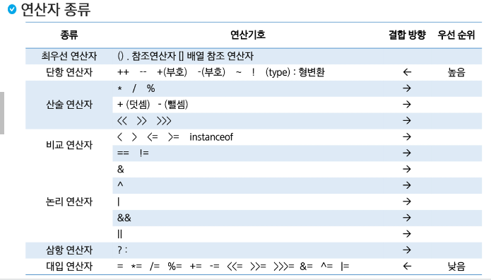

> 연산자가 동급이면 작성된 순서로 실행된다

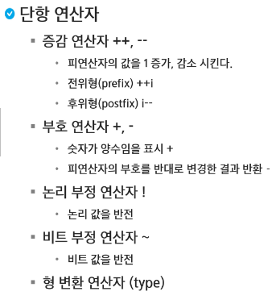

> Type Casting을 할 때 (type)으로 바꿔줄 수 있다.

```java
package java03.operator;

public class Op02_단항연산자 {
	public static void main(String[] args) {
		int a = 10;
		int b = 0;
		a++;
		System.out.println(a++);
		System.out.println(a);
		System.out.println(++b);
		System.out.println(b);
		
		/*
		 증감연산에서는 ++의 경우 특이한 점이 해당값이 참조된 후에 값이 변한다
		 그렇기에 출력을 해도 변하지 않는 값으로 나온다.
		 증감연산자를 앞에 붙여주면 참조되기 전에 계산된 값을 출력해준다.
		 */
	}
}
```

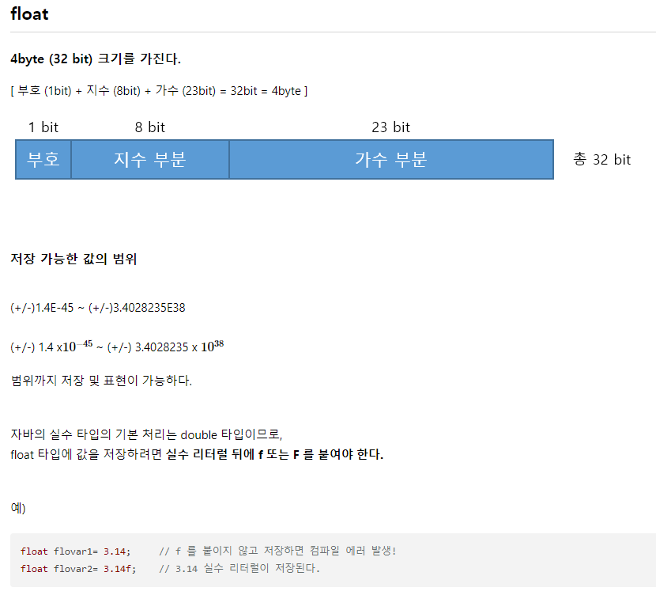

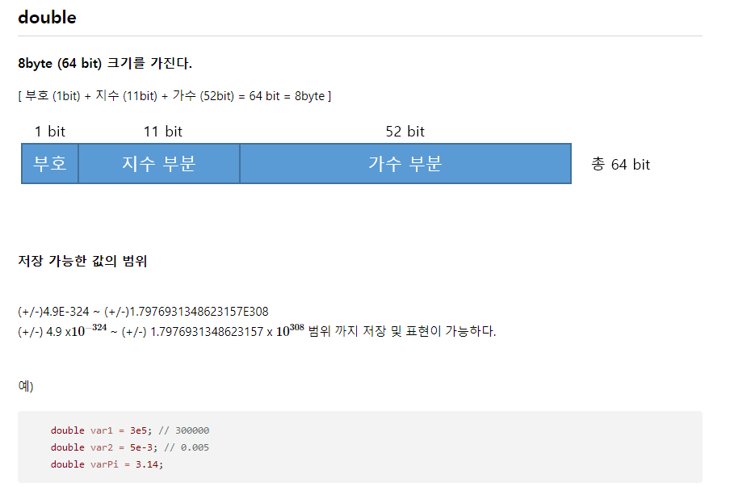

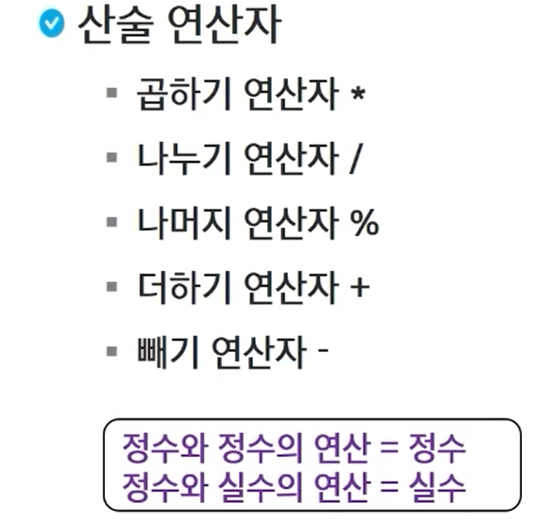

```java
package java03.operator;

public class Op02_산술연산자 {
	public static void main(String[] args) {
		int a = 10;
		int b = 6;
		
		System.out.println(a + b);
		System.out.println(a - b);
		System.out.println(a * b);
		System.out.println(a / b);
		System.out.println(a % b);
		
		System.out.println(a/(double)b);
		System.out.println((double)a/b);
		System.out.println((double)(a/b)); //-> 값이 1.0임... 아마도 정수와 정수를 연산해서 값이 정수로만 나온다
		
		float f = 3.14f; //-> float활용시 꼭 f를 붙여야함
		System.out.println(f);
	}
}
```

```java
package java03.operator;

public class 비교연산자 {
	public static void main(String[] args) {
		int a = 10;
		
		System.out.println(a > 10);
		System.out.println(a != 10);
		System.out.println(a >= 10);
		
		System.out.println(a == 10);
		System.out.println(a != 10);
		
		String c = "Hi";
		String d = "Hi";
		String e = new String("Hi");
		
		System.out.println(c == d);
		System.out.println(c == e);
		System.out.println(c.equals(e));
		
	}
}
```

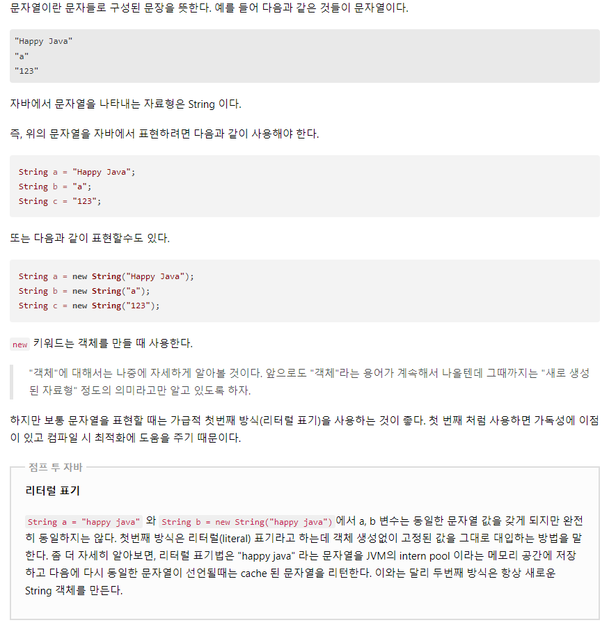

📢 문자열 내장 메서드

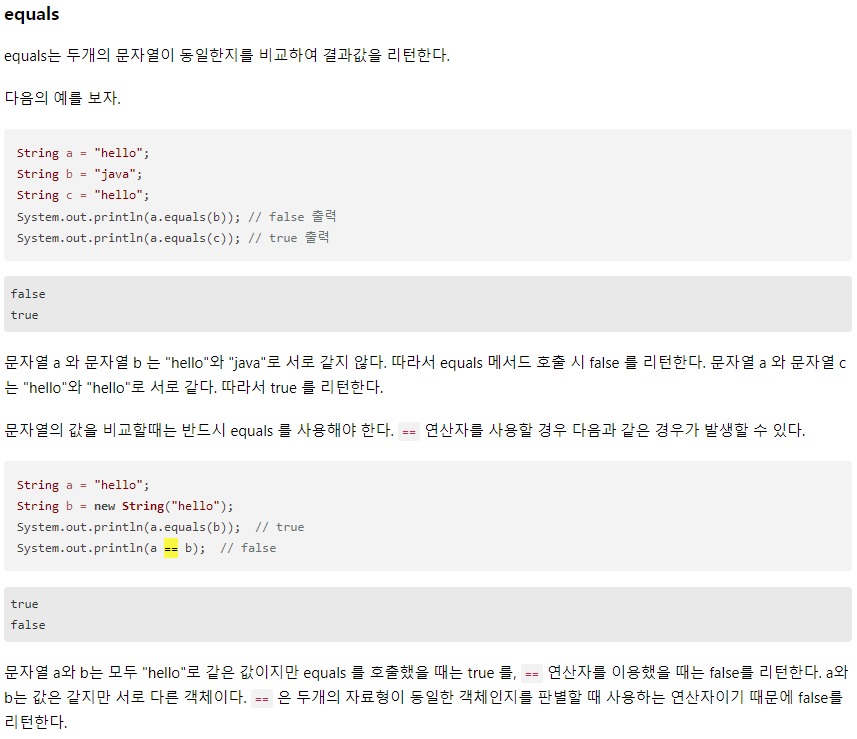

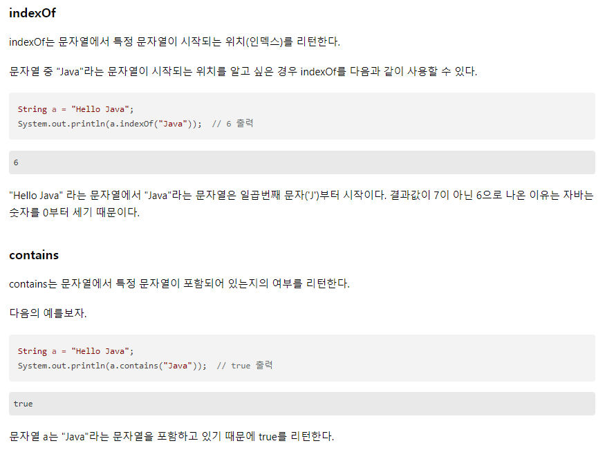

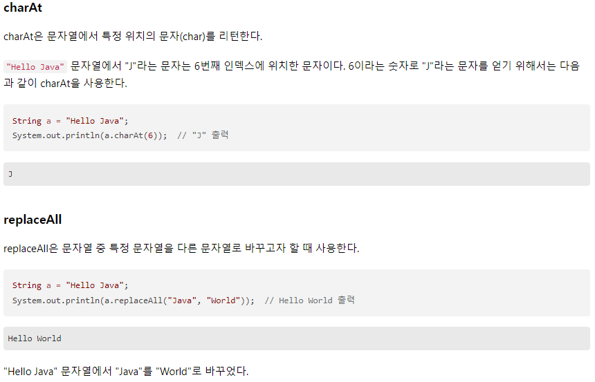

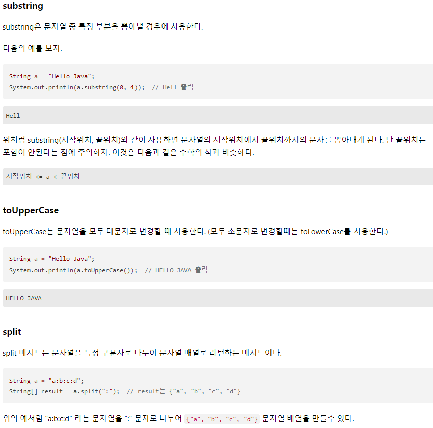

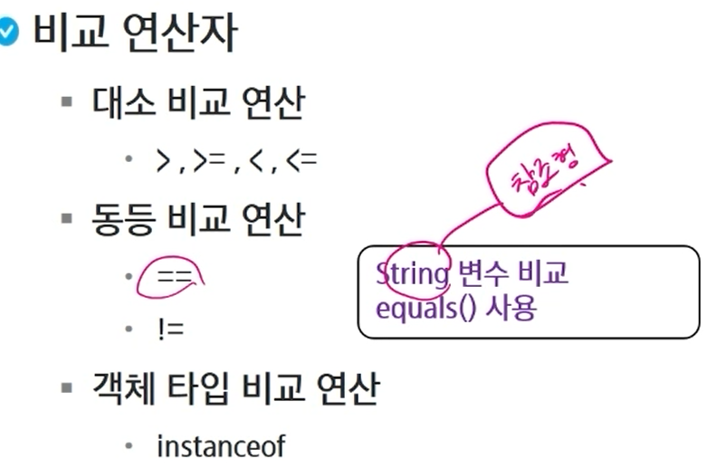

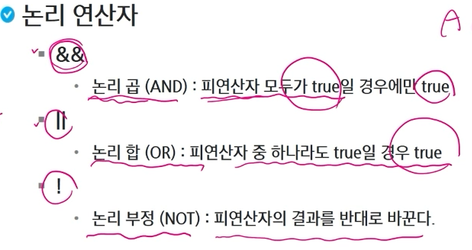

> 효율적인 연산이 가능(and일 경우 앞쪽에 false이면 바로 뒤 조건을 확인하지 않고 멈춤)
>
> or은 앞쪽에 true이면 뒤쪽 조건을 보지 않음

```java
package java03.operator;

public class 논리_연산자 {
	public static void main(String[] args) {
		int a = 10;
		int b = 20;
		
		System.out.println(a > 5 && b > 5);
		System.out.println(a > 5 && b < 5);
		System.out.println(a < 5 && b > 5);
		System.out.println(a < 5 && b < 5);
		
		System.out.println(a > 5 || b > 5);
		System.out.println(a > 5 || b < 5);
		System.out.println(a < 5 || b > 5);
		System.out.println(a < 5 || b < 5);
		
		System.out.println(!(a < 5 || b < 5));
        
        /*
        파이썬 50 <= a <= 70
        자바 50 <= a && a <= 70
        */
	}
}
```

```java
package java03.operator;

public class 삼항연산자 {
	public static void main(String[] args) {
		int num = (int) (Math.random()*10) + 1;
		
		System.out.println("내가 뭐라고 했더라???");
		System.out.println(num % 2 == 0 ? "even" : "odd");
	}
}

```

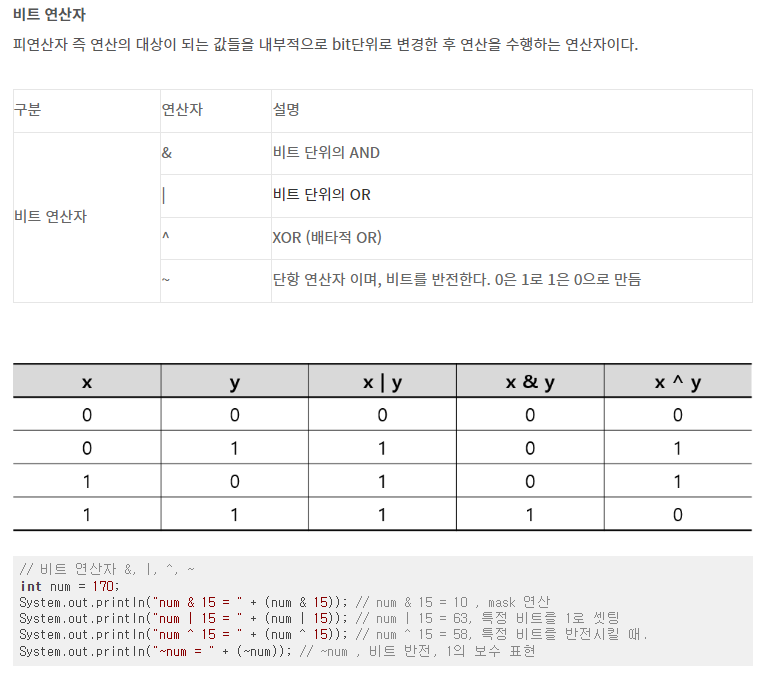

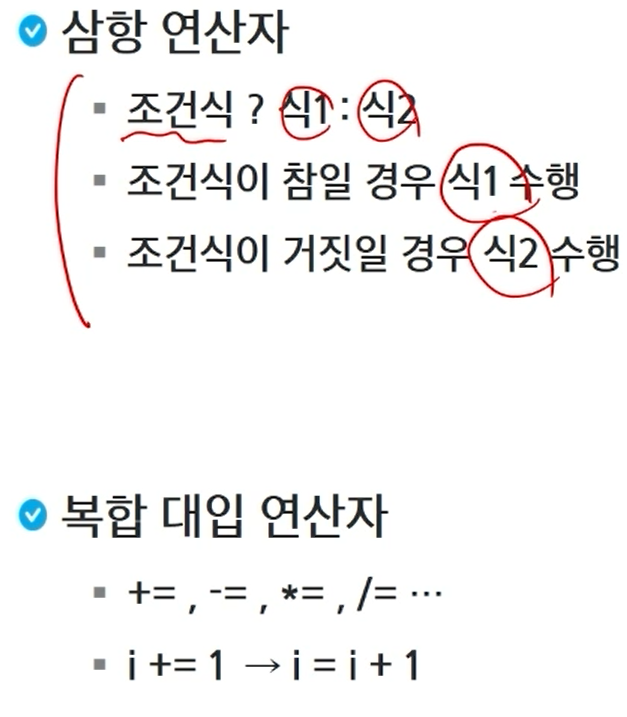