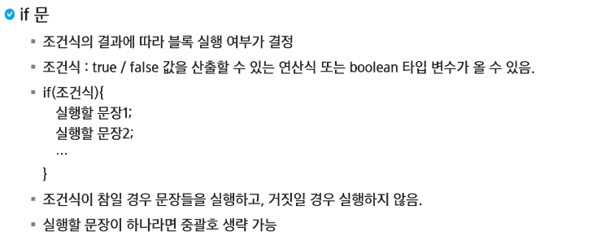
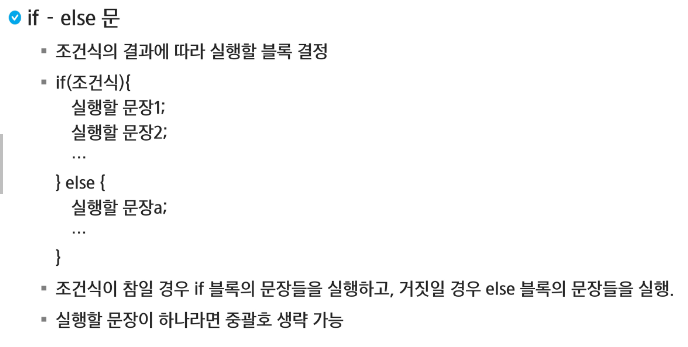
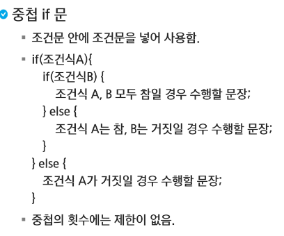
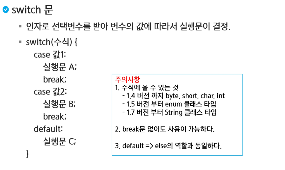

# 제어문(조건문_Conditional Statement)



> 중괄호는 생략하지 않기

```java
package java04.control;

public class IF01 {
	public static void main(String[] args) {
		//if(조건식) {} 조건식이 참일 경우 블록 내부 수행
		
		int n = 5;
		
		if (n < 10) {
			System.out.printf("print %d\n", n);
			System.out.printf("print11 %d\n", n);
		}
		
		//수행할 문장이 한 문장이라면 중괄호 생략 가능
		if (n < 10) 
			System.out.println("print");
		
		//위쪽은 조거문에 걸리는 출력, 아래는 조건과 상관 없는 출력
		if (n < 10)
			System.out.printf("print %d\n", n);
			System.out.printf("print11 %d\n", n);
		
	}
}
```



```java
package java04.control;

public class IF01 {
	public static void main(String[] args) {
		//if(조건식) { } else { } 조건식이 참일 경우 if 블록 내부 수행/거짓이면 else 블록 실행
		
		int age = 17;
		
		if (age < 20) {
			System.out.println("Drink alcohol");
		} else {
			System.out.println("Drink alcohol, too!!");
		}
		
		
		//둘 중 하나는 무조건 수행하므로 에러가 발생하지 않는다.
		int num;
		if (age < 20) {
			num = 10;
		} else {
			num = 20;
		}
		
		System.out.println(num);
	}
}
```



```java
package java04.control;

public class IF03 {
	public static void main(String[] args) {

		int score = 80;

		// 이상 초과 이하 미만
		// >= > <= <
		// 90점 이상 A학점
		// 90점 미만 80점 이상 B학점
		// 80점 미만 70점 이상 C학점
		// 그 외 F학점
		if (score >= 90)
			System.out.println("A");
		else if (score >= 80)
			System.out.println("B");
		else if (score >= 70)
			System.out.println("C");
		else
			System.out.println("F");

	}
}
```



```java
package java04.control;

public class Switch {
	public static void main(String[] args) {
		
		//달을 확인해 해당 달이 31일인지 / 30일인지 확인을 해보자 2월은 예외
		int month = 12;
		
		switch(month) {
		case 1:
		case 3:
		case 5:
		case 7:
		case 8:
		case 10:
		case 12:
			System.out.println("31일");
			break;
		case 4:
		case 6:
		case 9:
		case 11:
			System.out.println("30일");
			break;
		case 2:
			//윤년인지 아닌지 판단해야함.
			System.out.println("28일");
			break;
		default:
			System.out.println("그러한 달은 없다");	
		}
		
	}
}
```

