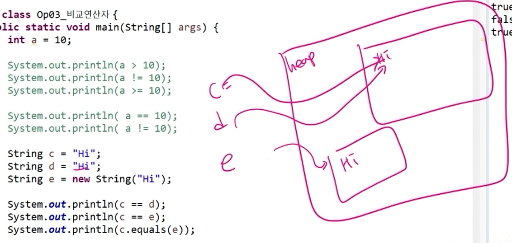
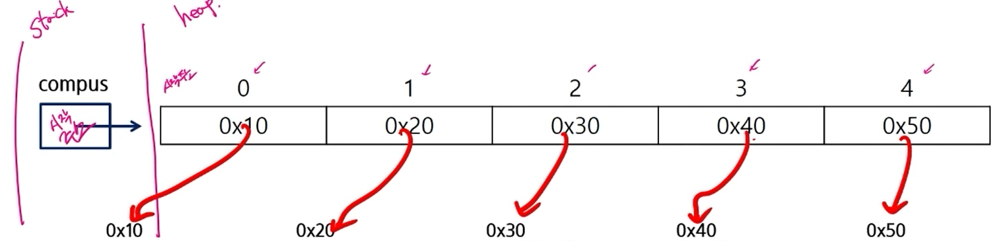

# ✨배열

### 배열의 정의 및 특징

- 같은 종류의 데이터를 저장하기 위한 자료구조
- 크기가 고정되어 있음. (한번 생성된 배열은 크기를 바꿀 수 없음)
- 배열을 객체로 취급
- 배열의 요소를 참조하려면 배열 이름과 색인(index)이라고 하는 int 유형의 정수 값을 조합하여 사용.

----

JVM 영역 내에는 **stack**과 **heap** 크게 두 가지로 나눌 수 있다(원래는 더 많음)

- Stack
  - 지역 변수, 메인 메서드 등이 stack 영역 내에서 생성
  - 참조할 값(heap)의 주소가 저장
- heap
  - 참조형, 객체 등이 생성
  - 참조되는 데이터가 저장되어 있다.
  - String같은 경우 예외적으로 new라는 키워드를 사용하지 않고도 생성이 가능
    - 여러 주소가 같은 데이터를 가리키고 있을 수 있다(String pool 공간)
    - 문자는 equals로 비교해주는 것이 좋다.
  - 배열도 객체로 만들어져서 단순히 배열 이름만 적어주면 주소 공간을 출력한다.



> c와 d는 주소값이 같아서 true를 반환. 내용을 비교하려면 equals를 사용해야 한다.



```
stack 영역 내에 campus 배열이 선언되면 heap 영역 내에 String으로 된 5개의 연속된 메모리가 할당된다. 주소를 따라 가보면 그 안에 주소가 들어있다. String이므로 데이터가 있는 곳을 가리키는 것임.
```

